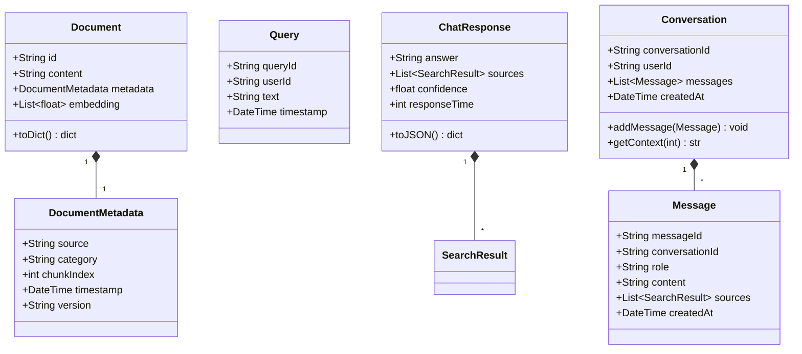
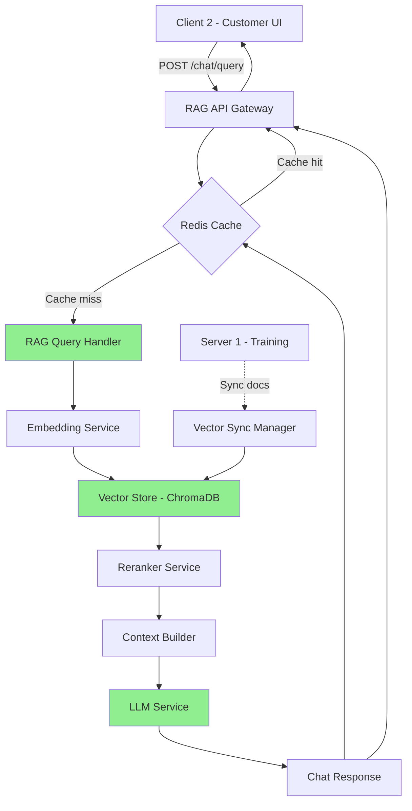
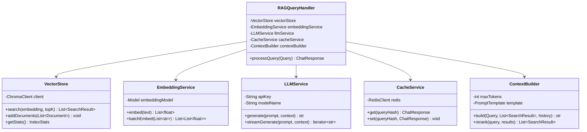
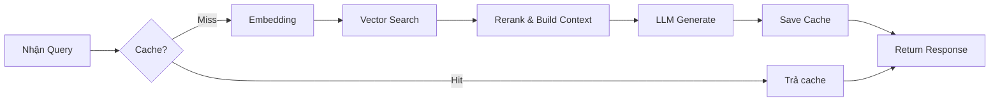
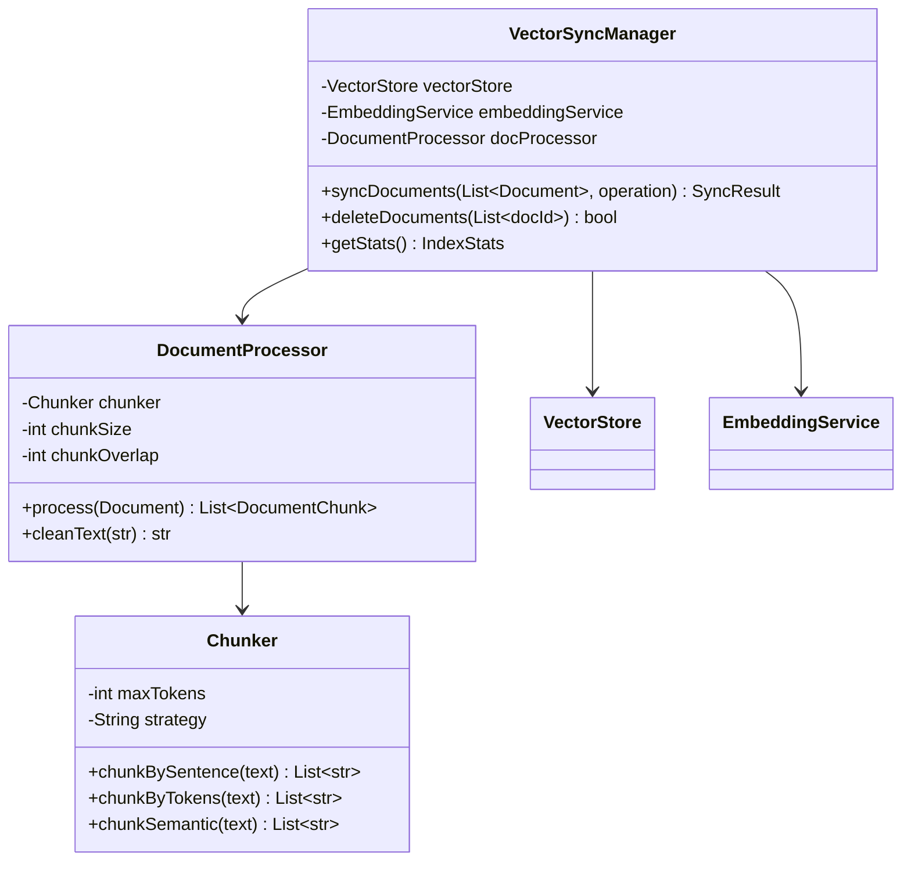
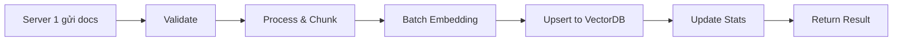
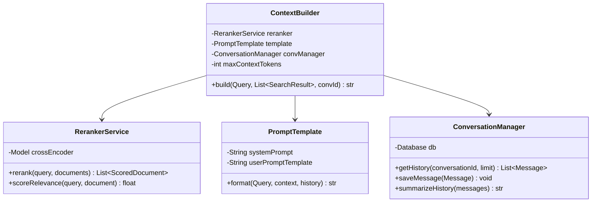
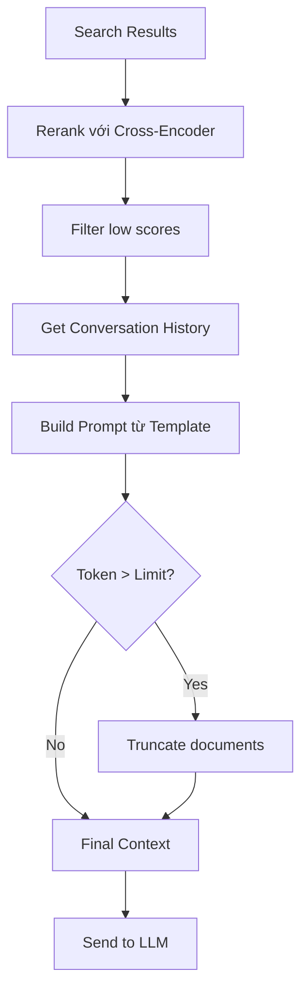
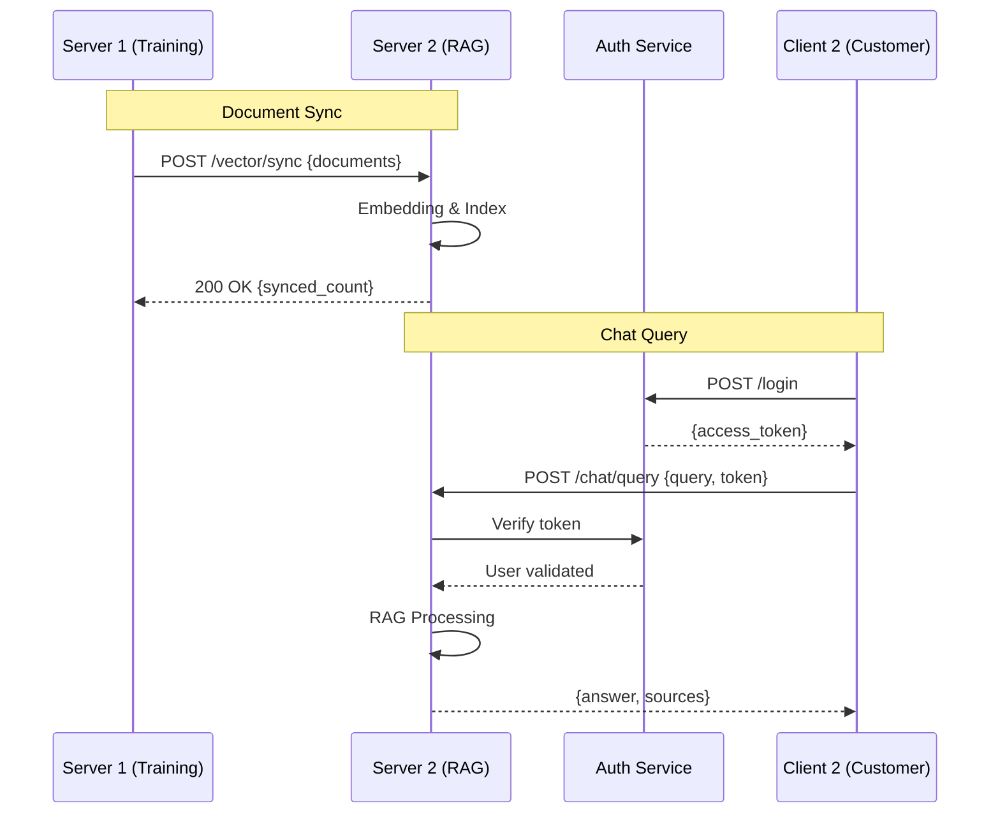
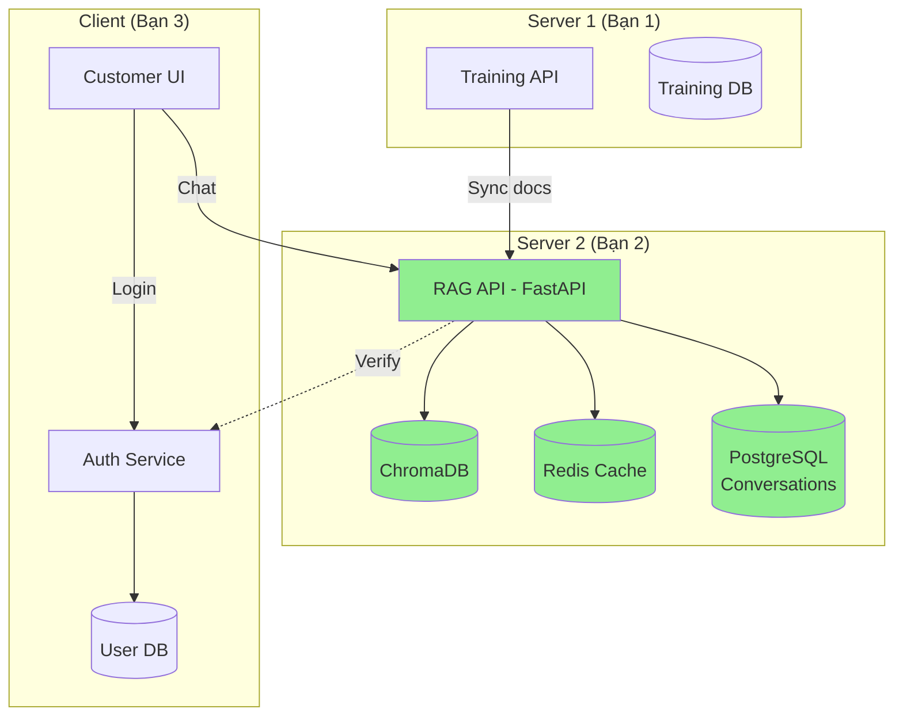

# BÁO CÁO THIẾT KẾ MODULE 2: CHATBOT APPLICATION & RAG MODULE

**Sinh viên thực hiện:** [Tên bạn]
**Mã sinh viên:** [MSSV]
**Lớp:** [Tên lớp]

---

## 1. TỔNG QUAN MODULE

### 1.1. Vai trò trong hệ thống
Module 2 đóng vai trò là **trung tâm xử lý RAG (Retrieval-Augmented Generation)** và cung cấp API chatbot cho người dùng cuối. Module này:
- Nhận câu hỏi từ Client 2 (Customer)
- Tìm kiếm thông tin liên quan từ vector database
- Tổng hợp context và sinh câu trả lời qua LLM
- Tích hợp model từ Server 1
- Trả kết quả về Client 2

### 1.2. Chức năng chính
1. **RAG Query Processing**: Xử lý câu hỏi và truy xuất thông tin
2. **Vector Database Management**: Quản lý embedding và similarity search
3. **LLM Integration & Context Building**: Tích hợp LLM và xây dựng context thông minh

### 1.3. Công nghệ sử dụng
- **Backend Framework**: FastAPI / Flask
- **Vector Database**: ChromaDB / Pinecone
- **LLM**: OpenAI API / Local LLM
- **Embedding Model**: sentence-transformers / OpenAI embeddings
- **Cache**: Redis (optional)

---

## 2. THIẾT KẾ CƠ SỞ DỮ LIỆU

### 2.1. Vector Database Schema (ChromaDB)

#### Collection: `ptit_knowledge_base`
```python
{
    "id": "doc_001",
    "document": "Nội dung văn bản gốc",
    "metadata": {
        "source": "ptit_tuyen_sinh.pdf",
        "category": "tuyen_sinh",
        "chunk_index": 0,
        "timestamp": "2025-01-15T10:30:00Z",
        "version": "v1.0"
    },
    "embedding": [0.123, 0.456, ...] # Vector 768 chiều
}
```

**Giải thích:**
- `id`: Unique identifier cho mỗi chunk
- `document`: Văn bản đã được chunking
- `metadata.source`: File nguồn gốc
- `metadata.category`: Danh mục (tuyển sinh, học phí, chương trình đào tạo, v.v.)
- `metadata.chunk_index`: Thứ tự chunk trong document
- `embedding`: Vector đại diện ngữ nghĩa

### 2.2. Conversation History Schema (PostgreSQL)

#### Table: `conversations`
```sql
CREATE TABLE conversations (
    conversation_id VARCHAR(36) PRIMARY KEY,
    user_id VARCHAR(36) NOT NULL,
    created_at TIMESTAMP DEFAULT CURRENT_TIMESTAMP,
    updated_at TIMESTAMP DEFAULT CURRENT_TIMESTAMP,
    status VARCHAR(20) DEFAULT 'active'
);
```

#### Table: `messages`
```sql
CREATE TABLE messages (
    message_id VARCHAR(36) PRIMARY KEY,
    conversation_id VARCHAR(36) REFERENCES conversations(conversation_id),
    role VARCHAR(10) NOT NULL, -- 'user' or 'assistant'
    content TEXT NOT NULL,
    sources JSON, -- [{doc_id, score, snippet}, ...]
    created_at TIMESTAMP DEFAULT CURRENT_TIMESTAMP,
    metadata JSON -- {model_version, response_time, etc.}
);
```

---

## 3. THIẾT KẾ LỚP THỰC THỂ (CLASS DIAGRAM)

### 3.1. Entity Classes



---

## 4. KIẾN TRÚC TỔNG QUAN MODULE

### 4.1. Sơ đồ kiến trúc hệ thống



### 4.2. Workflow tổng quát

**Pipeline xử lý query:**
1. **Check Cache**: Kiểm tra cache (Redis) có kết quả không
2. **Embedding**: Chuyển query thành vector embedding
3. **Vector Search**: Tìm kiếm top-k documents tương tự
4. **Reranking**: Re-rank kết quả bằng cross-encoder (tùy chọn)
5. **Context Building**: Xây dựng prompt từ query + documents + history
6. **LLM Generation**: Gọi LLM để sinh câu trả lời
7. **Cache & Return**: Lưu cache và trả về kết quả

---

## 5. THIẾT KẾ CHI TIẾT CÁC CHỨC NĂNG

---

## CHỨC NĂNG 1: RAG QUERY PROCESSING

### 5.1.1. Mô tả
Xử lý câu hỏi từ user, tìm kiếm thông tin liên quan, tổng hợp context và sinh câu trả lời.

### 5.1.2. Thiết kế giao diện API

#### Endpoint: `POST /api/v1/chat/query`

**Request:**
```json
{
    "query": "Học phí ngành CNTT năm 2025 là bao nhiêu?",
    "user_id": "user_123",
    "conversation_id": "conv_456",
    "options": {
        "top_k": 5,
        "temperature": 0.7,
        "use_cache": true
    }
}
```

**Response:**
```json
{
    "success": true,
    "data": {
        "answer": "Học phí ngành Công nghệ Thông tin năm 2025 là 12.000.000 VNĐ/năm...",
        "conversation_id": "conv_456",
        "sources": [
            {
                "doc_id": "doc_tuyen_sinh_2025_p3",
                "content": "Học phí các ngành năm 2025: CNTT: 12tr...",
                "score": 0.89,
                "metadata": {
                    "source": "tuyen_sinh_2025.pdf",
                    "category": "hoc_phi"
                }
            }
        ],
        "confidence": 0.92,
        "response_time_ms": 450
    }
}
```

### 5.1.3. Biểu đồ lớp chi tiết



**Giải thích các lớp:**

1. **RAGQueryHandler**: Orchestrator chính, điều phối toàn bộ pipeline RAG
2. **VectorStore**: Interface với ChromaDB, thực hiện similarity search
3. **EmbeddingService**: Chuyển đổi text thành vector embeddings
4. **LLMService**: Tích hợp với LLM (OpenAI/Local) để sinh câu trả lời
5. **ContextBuilder**: Xây dựng prompt, reranking, quản lý token limit
6. **CacheService**: Quản lý cache với Redis để tối ưu performance

### 5.1.4. Luồng xử lý đơn giản



---

## CHỨC NĂNG 2: VECTOR DATABASE MANAGEMENT

### 5.2.1. Mô tả
Quản lý việc đồng bộ documents từ Server 1, embedding, và index vào vector database.

### 5.2.2. Thiết kế giao diện API

#### Endpoint 1: `POST /api/v1/vector/sync`
Đồng bộ documents mới từ Server 1

**Request:**
```json
{
    "source": "server1_model_update",
    "documents": [
        {
            "id": "doc_new_001",
            "content": "Nội dung tài liệu mới...",
            "metadata": {
                "source": "tuyen_sinh_2026.pdf",
                "category": "tuyen_sinh",
                "version": "v2.0"
            }
        }
    ],
    "operation": "upsert"
}
```

**Response:**
```json
{
    "success": true,
    "data": {
        "synced_count": 145,
        "failed_count": 0,
        "total_vectors": 10245,
        "sync_time_ms": 3200
    }
}
```

#### Endpoint 2: `GET /api/v1/vector/stats`
Thống kê vector database

**Response:**
```json
{
    "success": true,
    "data": {
        "total_documents": 10245,
        "collections": [
            {
                "name": "ptit_knowledge_base",
                "count": 10245,
                "dimensions": 768,
                "categories": {
                    "tuyen_sinh": 3420,
                    "hoc_phi": 1250,
                    "chuong_trinh_dao_tao": 5575
                }
            }
        ],
        "last_update": "2025-01-15T14:30:00Z"
    }
}
```

### 5.2.3. Biểu đồ lớp chi tiết



**Giải thích:**

1. **VectorSyncManager**: Quản lý đồng bộ documents từ Server 1
2. **DocumentProcessor**: Xử lý documents (clean, chunk, extract metadata)
3. **Chunker**: Chiến lược chia nhỏ documents (sentence, token, semantic)

### 5.2.4. Luồng xử lý sync



---

## CHỨC NĂNG 3: LLM INTEGRATION & CONTEXT BUILDING

### 5.3.1. Mô tả
Tích hợp LLM và xây dựng context thông minh với reranking, conversation history.

### 5.3.2. Biểu đồ lớp chi tiết



**Giải thích:**

1. **ContextBuilder**: Xây dựng context prompt hoàn chỉnh
2. **RerankerService**: Re-rank kết quả search bằng cross-encoder model
3. **PromptTemplate**: Quản lý system prompt và user prompt templates
4. **ConversationManager**: Quản lý lịch sử hội thoại

### 5.3.3. Context Building Pipeline



**Prompt Template Example:**
```python
system_prompt = """Bạn là chatbot tư vấn của PTIT.
Trả lời dựa trên thông tin được cung cấp.
Nếu không biết, hãy nói rõ."""

user_prompt = """
Context: {retrieved_documents}
Conversation History: {history}
Question: {user_query}

Answer:
"""
```

---

## 6. TƯƠNG TÁC VỚI CÁC MODULE KHÁC

### 6.1. Tổng quan tương tác



### 6.2. API cần thiết

**Từ Server 1:**
- `POST /vector/sync`: Đồng bộ documents
- `POST /model/update`: Thông báo model mới

**Từ Auth Service (Module 3):**
- `POST /auth/verify`: Verify JWT token
- `GET /user/{user_id}`: Lấy thông tin user

### 6.3. Biểu đồ triển khai



---

## 7. ĐÁNH GIÁ & TỐI ƯU HÓA

### 7.1. Metrics theo dõi

1. **Performance Metrics:**
- Response time (p50, p95, p99)
- Cache hit rate
- Vector search latency
- LLM generation time

2. **Quality Metrics:**
- Confidence score distribution
- User feedback (thumbs up/down)
- Source relevance score

3. **System Metrics:**
- Vector DB size
- Embedding cost per query
- Token usage

### 7.2. Chiến lược tối ưu hóa

1. **Caching Strategy:**
- Cache câu hỏi phổ biến (FAQ)
- TTL: 1 giờ cho dynamic content, 24 giờ cho static

2. **Performance:**
- Batch embedding để giảm API calls
- Async vector sync
- Streaming response cho LLM

3. **Quality:**
- Rerank top 20 results với cross-encoder
- Dynamic prompt engineering
- Conversation history summarization

4. **Cost Optimization:**
- Cache aggressive cho duplicate queries
- Token limit management
- Model selection based on query complexity

---

## 8. KẾT LUẬN

### 8.1. Tổng kết
Module 2 (RAG Chatbot) là trung tâm xử lý của hệ thống:
- **Server 1**: Nhận documents và model updates
- **Client 2**: Phục vụ chat queries cho end-users

Thiết kế đơn giản, tập trung vào:
- **Scalability**: Vector DB scale đến hàng triệu documents
- **Performance**: Cache + batch processing + streaming
- **Accuracy**: Reranking + context synthesis + conversation history

### 8.2. Công nghệ stack
- **Backend**: FastAPI (async support)
- **Vector DB**: ChromaDB (embeddings storage)
- **Cache**: Redis (query caching)
- **Database**: PostgreSQL (conversations)
- **LLM**: OpenAI API / Local LLM
- **Embedding**: sentence-transformers

### 8.3. Công việc tiếp theo
1. Implement RAG pipeline với FastAPI
2. Setup ChromaDB + embedding service
3. Implement caching layer với Redis
4. Integration testing với Server 1 và Client 2
5. Performance monitoring & tuning

---

**Ngày hoàn thành:** [Ngày/Tháng/Năm]
**Chữ ký:** _______________
