# BÁO CÁO THIẾT KẾ HỆ THỐNG CHATBOT TƯ VẤN THÔNG TIN TRƯỜNG PTIT

## PHẦN 1: THIẾT KẾ KIẾN TRÚC HỆ THỐNG (CHUNG CHO CẢ NHÓM)

### 1.1. Tổng quan kiến trúc

Hệ thống Chatbot tư vấn thông tin trường PTIT được xây dựng dựa trên kiến trúc RAG (Retrieval-Augmented Generation) với các thành phần chính sau:

```
┌─────────────────────────────────────────────────────────────┐
│                        Client Layer                           │
├─────────────────────────────────────────────────────────────┤
│  ┌──────────────┐  ┌──────────────┐  ┌──────────────┐      │
│  │   Web UI     │  │   Admin UI   │  │  Mobile App  │      │
│  │ (Streamlit)  │  │              │  │   (Future)   │      │
│  └──────────────┘  └──────────────┘  └──────────────┘      │
└─────────────────────────────────────────────────────────────┘
                              │
                    ┌─────────▼─────────┐
                    │   API Gateway      │
                    │   (WebSocket)      │
                    └─────────┬─────────┘
                              │
┌─────────────────────────────────────────────────────────────┐
│                     Application Layer                         │
├─────────────────────────────────────────────────────────────┤
│  ┌──────────────┐  ┌──────────────┐  ┌──────────────┐      │
│  │ Conversation │  │   Context    │  │   Response   │      │
│  │   Handler    │  │  Synthesis   │  │  Generator   │      │
│  └──────────────┘  └──────────────┘  └──────────────┘      │
│  ┌──────────────┐  ┌──────────────┐  ┌──────────────┐      │
│  │    Query     │  │  Document    │  │   Admin      │      │
│  │   Refiner    │  │   Loader     │  │  Services    │      │
│  └──────────────┘  └──────────────┘  └──────────────┘      │
└─────────────────────────────────────────────────────────────┘
                              │
┌─────────────────────────────────────────────────────────────┐
│                      Core Services Layer                      │
├─────────────────────────────────────────────────────────────┤
│  ┌──────────────┐  ┌──────────────┐  ┌──────────────┐      │
│  │   LLM Client │  │   Embedder   │  │    Chat      │      │
│  │  (LlamaCpp)  │  │   Service    │  │   History    │      │
│  └──────────────┘  └──────────────┘  └──────────────┘      │
└─────────────────────────────────────────────────────────────┘
                              │
┌─────────────────────────────────────────────────────────────┐
│                       Data Layer                              │
├─────────────────────────────────────────────────────────────┤
│  ┌──────────────┐  ┌──────────────┐  ┌──────────────┐      │
│  │Vector Store  │  │  Document    │  │    Model     │      │
│  │  (Chroma)    │  │   Storage    │  │   Storage    │      │
│  └──────────────┘  └──────────────┘  └──────────────┘      │
└─────────────────────────────────────────────────────────────┘
```

### 1.2. Luồng xử lý chính

1. **Luồng xử lý câu hỏi của người dùng:**
   - Người dùng nhập câu hỏi qua giao diện Web UI
   - Câu hỏi được gửi qua WebSocket tới Application Layer
   - Query Refiner tinh chỉnh câu hỏi để tối ưu cho việc tìm kiếm
   - Embedder Service chuyển đổi câu hỏi thành vector embedding
   - Vector Store (Chroma) tìm kiếm các đoạn văn bản liên quan nhất
   - Context Synthesis Strategy tổng hợp context từ các đoạn văn bản
   - LLM Client (LlamaCpp) sinh câu trả lời dựa trên context
   - Response được trả về cho người dùng qua WebSocket

2. **Luồng xử lý dữ liệu đầu vào:**
   - Admin upload tài liệu (PDF, MD, TXT) về thông tin trường PTIT
   - Document Loader đọc và xử lý tài liệu
   - Text Splitter chia tài liệu thành các chunks nhỏ
   - Embedder Service tạo embeddings cho mỗi chunk
   - Lưu embeddings và metadata vào Vector Store

### 1.3. Các công nghệ sử dụng

- **Frontend:** Streamlit (Web UI)
- **Backend:** Python 3.10+
- **LLM Framework:** llama-cpp-python
- **Vector Database:** ChromaDB
- **Embeddings Model:** all-MiniLM-L6-v2
- **LLM Models:** Llama 3.1, Qwen 2.5, OpenChat 3.6
- **Communication:** WebSocket, REST API

### 1.4. Các patterns và nguyên tắc thiết kế

- **Singleton Pattern:** Áp dụng cho LLM Client, Vector Store
- **Strategy Pattern:** Context Synthesis Strategies
- **Factory Pattern:** Model Registry
- **Repository Pattern:** Document Storage, Vector Database
- **SOLID Principles:**
  - Single Responsibility: Mỗi class chỉ đảm nhận một chức năng
  - Open/Closed: Dễ dàng mở rộng thêm model, strategy mới
  - Dependency Inversion: Sử dụng abstraction cho các dependencies

---

## PHẦN 2: THIẾT KẾ CHI TIẾT - BẠN THỨ NHẤT

**Họ tên:** Nguyễn Văn A
**Mã SV:** B21DCCN001
**Phụ trách:** Module RAG Core và Vector Database

### 2.1. Thiết kế CSDL liên quan module

#### 2.1.1. Schema Vector Database (ChromaDB)

```sql
-- Collection: documents_embeddings
CREATE TABLE documents_embeddings (
    id UUID PRIMARY KEY DEFAULT gen_random_uuid(),
    embedding VECTOR(384), -- 384 dimensions for all-MiniLM-L6-v2
    document TEXT NOT NULL,
    metadata JSONB,
    created_at TIMESTAMP DEFAULT CURRENT_TIMESTAMP
);

-- Index for vector similarity search
CREATE INDEX idx_embedding_cosine ON documents_embeddings
USING ivfflat (embedding vector_cosine_ops)
WITH (lists = 100);

-- Metadata structure
-- {
--   "source": "student_handbook.pdf",
--   "page": 12,
--   "chapter": "Quy chế đào tạo",
--   "section": "Điều kiện tốt nghiệp",
--   "chunk_id": "doc_001_chunk_042",
--   "created_date": "2024-01-15"
-- }
```

#### 2.1.2. Schema Chat History

```sql
CREATE TABLE chat_sessions (
    session_id UUID PRIMARY KEY DEFAULT gen_random_uuid(),
    user_id VARCHAR(255),
    created_at TIMESTAMP DEFAULT CURRENT_TIMESTAMP,
    updated_at TIMESTAMP DEFAULT CURRENT_TIMESTAMP
);

CREATE TABLE chat_messages (
    message_id UUID PRIMARY KEY DEFAULT gen_random_uuid(),
    session_id UUID REFERENCES chat_sessions(session_id),
    role VARCHAR(50) NOT NULL, -- 'user', 'assistant', 'system'
    content TEXT NOT NULL,
    metadata JSONB,
    created_at TIMESTAMP DEFAULT CURRENT_TIMESTAMP
);

CREATE INDEX idx_session_messages ON chat_messages(session_id, created_at);
```

### 2.2. Thiết kế lớp thực thể

#### 2.2.1. Document Entity

```python
from dataclasses import dataclass
from typing import Dict, Any, Optional
from datetime import datetime

@dataclass
class Document:
    """Entity representing a document chunk"""
    page_content: str
    metadata: Dict[str, Any]
    embedding: Optional[List[float]] = None
    document_id: Optional[str] = None
    created_at: Optional[datetime] = None

    def to_dict(self) -> Dict:
        return {
            'page_content': self.page_content,
            'metadata': self.metadata,
            'embedding': self.embedding,
            'document_id': self.document_id,
            'created_at': self.created_at.isoformat() if self.created_at else None
        }
```

#### 2.2.2. ChatMessage Entity

```python
@dataclass
class ChatMessage:
    """Entity representing a chat message"""
    role: str  # 'user', 'assistant', 'system'
    content: str
    session_id: Optional[str] = None
    message_id: Optional[str] = None
    metadata: Optional[Dict[str, Any]] = None
    created_at: Optional[datetime] = None
```

### 2.3. Chức năng 1: Similarity Search với Vector Database

#### 2.3.1. Thiết kế giao diện

```
┌─────────────────────────────────────────────┐
│          SIMILARITY SEARCH INTERFACE         │
├─────────────────────────────────────────────┤
│                                              │
│  Query: [________________________] [Search] │
│                                              │
│  Advanced Options:                          │
│  ├─ Top K Results: [5 ▼]                   │
│  ├─ Threshold: [0.7 ▼]                     │
│  └─ Filter by: [All Categories ▼]          │
│                                              │
│  Results:                                    │
│  ┌────────────────────────────────────────┐ │
│  │ 📄 Document: student_handbook.pdf      │ │
│  │    Score: 0.92                         │ │
│  │    Preview: "Điều kiện tốt nghiệp..."  │ │
│  └────────────────────────────────────────┘ │
│  ┌────────────────────────────────────────┐ │
│  │ 📄 Document: admission_guide.pdf       │ │
│  │    Score: 0.85                         │ │
│  │    Preview: "Quy trình xét tuyển..."   │ │
│  └────────────────────────────────────────┘ │
│                                              │
└─────────────────────────────────────────────┘
```

#### 2.3.2. Thiết kế lớp chi tiết

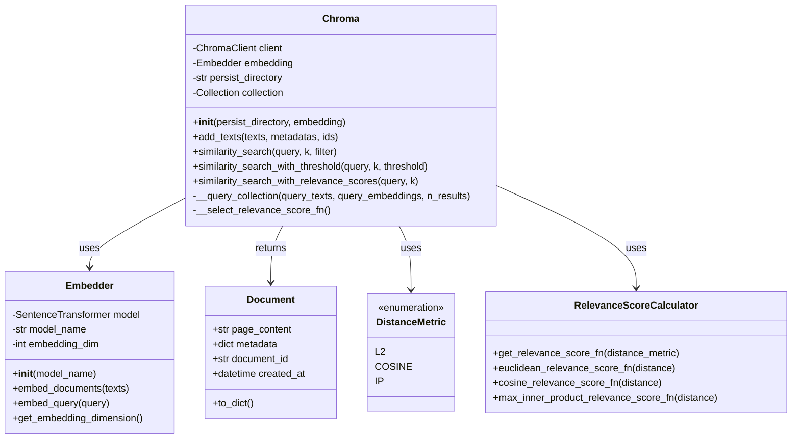

**Giải thích thiết kế:**
- **Chroma**: Lớp chính quản lý vector database, cung cấp các phương thức tìm kiếm
- **Embedder**: Chịu trách nhiệm chuyển đổi text thành vector embeddings
- **Document**: Entity đại diện cho một chunk văn bản
- **DistanceMetric**: Enum định nghĩa các loại distance metrics
- **RelevanceScoreCalculator**: Tính toán độ liên quan dựa trên distance

#### 2.3.3. Biểu đồ hoạt động

```mermaid
activity
  start
  :User enters search query;
  :System receives query;

  if (Query is empty?) then (yes)
    :Show error message;
    stop
  else (no)
    :Refine query using LLM;
  endif

  :Convert query to embedding vector;
  :Search in vector database;

  fork
    :Calculate L2 distance;
  fork again
    :Apply metadata filters;
  fork again
    :Sort by relevance score;
  end fork

  :Retrieve top K results;

  if (Results above threshold?) then (yes)
    :Format and return results;
  else (no)
    :Return empty result with message;
  endif

  :Display results to user;
  stop
```

#### 2.3.4. Biểu đồ tuần tự

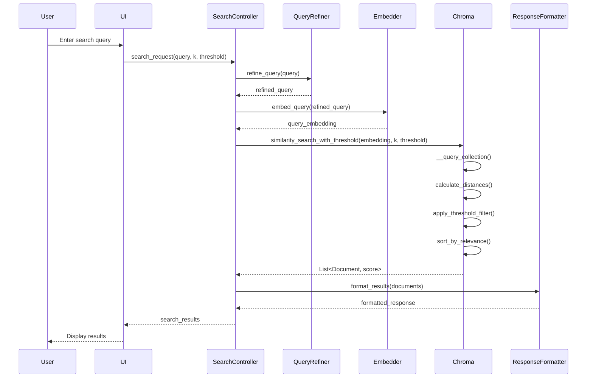

### 2.4. Chức năng 2: Document Processing và Indexing

#### 2.4.1. Thiết kế giao diện

```
┌─────────────────────────────────────────────┐
│         DOCUMENT PROCESSING INTERFACE        │
├─────────────────────────────────────────────┤
│                                              │
│  Upload Documents:                          │
│  ┌────────────────────────────────────────┐ │
│  │ 📁 Drop files here or click to browse  │ │
│  │                                         │ │
│  │  Supported: PDF, MD, TXT, DOCX         │ │
│  └────────────────────────────────────────┘ │
│                                              │
│  Processing Options:                        │
│  ├─ Chunk Size: [1000 ▼]                   │
│  ├─ Chunk Overlap: [200 ▼]                 │
│  └─ Split Method: [Recursive ▼]            │
│                                              │
│  Documents Queue:                           │
│  ┌────────────────────────────────────────┐ │
│  │ ✅ student_handbook.pdf (342 chunks)   │ │
│  │ ⏳ admission_guide.pdf (Processing...) │ │
│  │ ⏸️ curriculum.docx (Queued)           │ │
│  └────────────────────────────────────────┘ │
│                                              │
│  [Process All] [Pause] [Clear Queue]        │
│                                              │
└─────────────────────────────────────────────┘
```

#### 2.4.2. Thiết kế lớp chi tiết

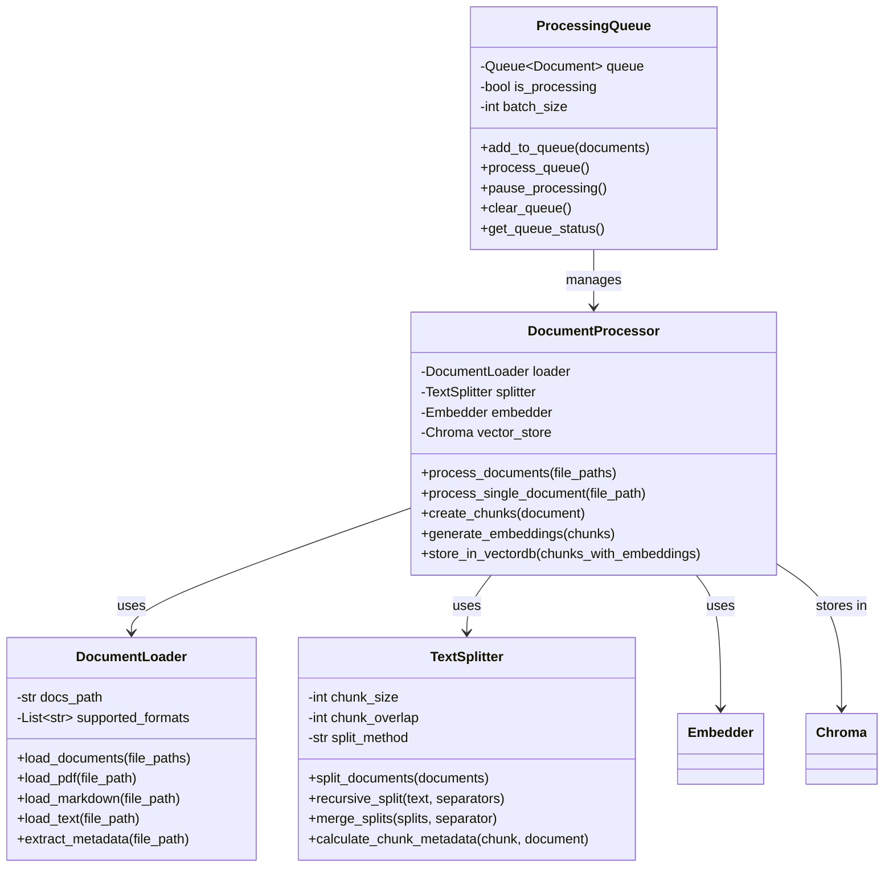

**Giải thích thiết kế:**
- **DocumentLoader**: Đọc và chuyển đổi các định dạng tài liệu khác nhau
- **TextSplitter**: Chia tài liệu thành các chunks với kích thước phù hợp
- **DocumentProcessor**: Điều phối toàn bộ quá trình xử lý tài liệu
- **ProcessingQueue**: Quản lý hàng đợi xử lý tài liệu

#### 2.4.3. Biểu đồ hoạt động

```mermaid
activity
  start
  :Admin uploads documents;

  if (Valid file format?) then (no)
    :Show error message;
    stop
  else (yes)
    :Add to processing queue;
  endif

  while (Documents in queue?) is (yes)
    :Get next document;
    :Load document content;

    switch (Document type?)
    case (PDF)
      :Extract PDF text;
    case (Markdown)
      :Parse markdown;
    case (Text)
      :Read plain text;
    endswitch

    :Split into chunks;
    :Generate embeddings for chunks;
    :Store in vector database;
    :Update processing status;
  endwhile (no)

  :Show completion message;
  stop
```

#### 2.4.4. Biểu đồ tuần tự

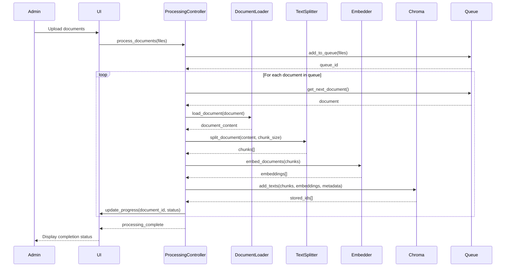

---

## PHẦN 3: THIẾT KẾ CHI TIẾT - BẠN THỨ HAI

**Họ tên:** Trần Thị B
**Mã SV:** B21DCCN002
**Phụ trách:** Module Chat Interface và Conversation Management

### 3.1. Thiết kế CSDL liên quan module

#### 3.1.1. Schema Conversation Management

```sql
CREATE TABLE conversations (
    conversation_id UUID PRIMARY KEY DEFAULT gen_random_uuid(),
    session_id UUID NOT NULL,
    user_id VARCHAR(255),
    title VARCHAR(500),
    created_at TIMESTAMP DEFAULT CURRENT_TIMESTAMP,
    updated_at TIMESTAMP DEFAULT CURRENT_TIMESTAMP,
    is_active BOOLEAN DEFAULT true
);

CREATE TABLE conversation_turns (
    turn_id UUID PRIMARY KEY DEFAULT gen_random_uuid(),
    conversation_id UUID REFERENCES conversations(conversation_id),
    user_message TEXT NOT NULL,
    assistant_response TEXT NOT NULL,
    context_used TEXT[],
    response_time_ms INTEGER,
    tokens_used INTEGER,
    created_at TIMESTAMP DEFAULT CURRENT_TIMESTAMP
);

CREATE TABLE conversation_feedback (
    feedback_id UUID PRIMARY KEY DEFAULT gen_random_uuid(),
    turn_id UUID REFERENCES conversation_turns(turn_id),
    rating INTEGER CHECK (rating >= 1 AND rating <= 5),
    feedback_text TEXT,
    created_at TIMESTAMP DEFAULT CURRENT_TIMESTAMP
);
```

### 3.2. Thiết kế lớp thực thể

```python
@dataclass
class Conversation:
    """Entity representing a conversation session"""
    conversation_id: str
    session_id: str
    user_id: Optional[str]
    title: str
    created_at: datetime
    updated_at: datetime
    is_active: bool = True
    turns: List['ConversationTurn'] = field(default_factory=list)

@dataclass
class ConversationTurn:
    """Entity representing a single turn in conversation"""
    turn_id: str
    conversation_id: str
    user_message: str
    assistant_response: str
    context_used: List[str]
    response_time_ms: int
    tokens_used: int
    created_at: datetime
```

### 3.3. Chức năng 1: Real-time Chat với WebSocket

#### 3.3.1. Thiết kế giao diện

```
┌─────────────────────────────────────────────┐
│           PTIT CHATBOT ASSISTANT            │
├─────────────────────────────────────────────┤
│ 💬 Conversations     │   Chat Window        │
│ ┌──────────────┐    │  ┌─────────────────┐ │
│ │ ▶ Tuyển sinh │    │  │ 🤖 Assistant:   │ │
│ │   Học phí    │    │  │ Xin chào! Tôi   │ │
│ │   Chương trình│   │  │ có thể giúp gì  │ │
│ └──────────────┘    │  │ cho bạn?        │ │
│                      │  └─────────────────┘ │
│ [+ New Chat]        │  ┌─────────────────┐ │
│                      │  │ 👤 You:         │ │
│                      │  │ Điều kiện xét   │ │
│                      │  │ tuyển là gì?    │ │
│                      │  └─────────────────┘ │
│                      │  ┌─────────────────┐ │
│                      │  │ 🤖 Đang trả lời.│ │
│                      │  │ ▌               │ │
│                      │  └─────────────────┘ │
│                      │                      │
│                      │ ┌──────────────────┐ │
│                      │ │Type message...   │ │
│                      │ │                  │ │
│                      │ └──────────────────┘ │
│                      │ [📎] [🎤] [Send]    │
└─────────────────────────────────────────────┘
```

#### 3.3.2. Thiết kế lớp chi tiết

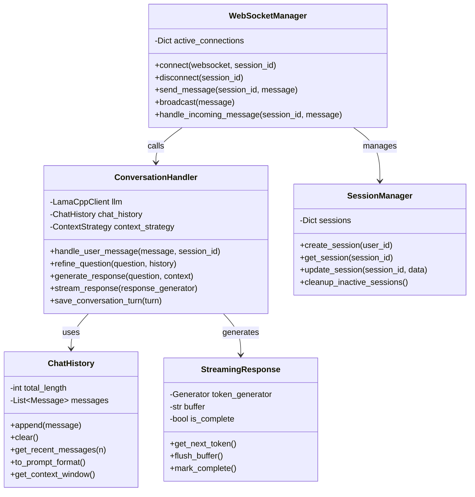

**Giải thích thiết kế:**
- **ConversationHandler**: Xử lý logic chính của cuộc hội thoại
- **ChatHistory**: Quản lý lịch sử chat và context window
- **WebSocketManager**: Quản lý kết nối WebSocket real-time
- **StreamingResponse**: Xử lý streaming response từ LLM
- **SessionManager**: Quản lý các phiên làm việc của người dùng

#### 3.3.3. Biểu đồ hoạt động

```mermaid
activity
  start
  :User connects to chat;
  :Create/restore session;
  :Initialize WebSocket connection;

  while (Session active?) is (yes)
    :Wait for user message;

    if (Message received?) then (yes)
      :Add to chat history;
      :Refine question with context;
      :Retrieve relevant documents;

      fork
        :Generate response stream;
      fork again
        :Send tokens to client;
      fork again
        :Update UI progressively;
      end fork

      :Save conversation turn;
      :Update chat history;
    else (no)
      :Check connection status;
    endif

    if (User disconnects?) then (yes)
      :Save session state;
      :Close WebSocket;
      stop
    endif
  endwhile (no)

  stop
```

#### 3.3.4. Biểu đồ tuần tự

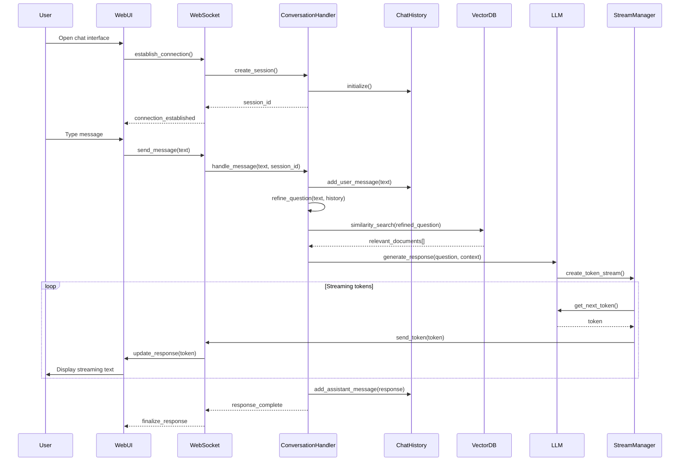

### 3.4. Chức năng 2: Context-Aware Response Generation

#### 3.4.1. Thiết kế giao diện

```
┌─────────────────────────────────────────────┐
│       CONTEXT & RESPONSE GENERATION          │
├─────────────────────────────────────────────┤
│                                              │
│  Current Context Window:                    │
│  ┌────────────────────────────────────────┐ │
│  │ 📊 Context Usage: 2048/4096 tokens     │ │
│  │ ├─ System Prompt: 150 tokens          │ │
│  │ ├─ Chat History: 500 tokens           │ │
│  │ └─ Retrieved Docs: 1398 tokens        │ │
│  └────────────────────────────────────────┘ │
│                                              │
│  Response Strategy: [Tree Summarization ▼]  │
│                                              │
│  Retrieved Context:                         │
│  ┌────────────────────────────────────────┐ │
│  │ 1. 📄 Quy chế tuyển sinh (Score: 0.95) │ │
│  │    "Điểm xét tuyển = Điểm thi THPT..." │ │
│  ├────────────────────────────────────────┤ │
│  │ 2. 📄 Hướng dẫn nhập học (Score: 0.88) │ │
│  │    "Thí sinh trúng tuyển cần nộp..."   │ │
│  └────────────────────────────────────────┘ │
│                                              │
│  Response Generation:                       │
│  ┌────────────────────────────────────────┐ │
│  │ ⚡ Generating response...               │ │
│  │ Progress: ████████░░ 80%               │ │
│  └────────────────────────────────────────┘ │
│                                              │
└─────────────────────────────────────────────┘
```

#### 3.4.2. Thiết kế lớp chi tiết

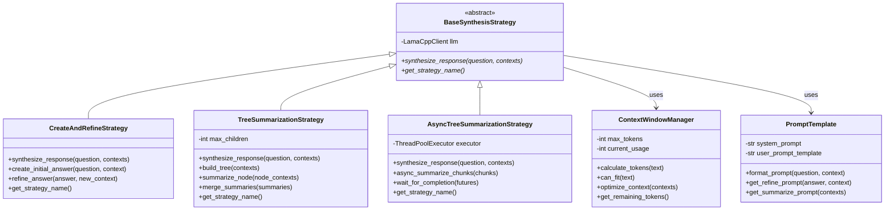

**Giải thích thiết kế:**
- **BaseSynthesisStrategy**: Abstract class định nghĩa interface cho các strategy
- **CreateAndRefineStrategy**: Tạo câu trả lời ban đầu và tinh chỉnh dần
- **TreeSummarizationStrategy**: Tổng hợp theo cấu trúc cây
- **AsyncTreeSummarizationStrategy**: Tổng hợp song song để tăng tốc độ
- **ContextWindowManager**: Quản lý và tối ưu context window
- **PromptTemplate**: Quản lý các template prompt

#### 3.4.3. Biểu đồ hoạt động

```mermaid
activity
  start
  :Receive question and contexts;

  :Calculate total tokens;
  if (Exceeds context window?) then (yes)
    :Select synthesis strategy;

    switch (Strategy type?)
    case (Create & Refine)
      :Create initial answer;
      while (More contexts?) is (yes)
        :Refine with next context;
      endwhile (no)
    case (Tree Summarization)
      :Build context tree;
      :Summarize leaf nodes;
      :Merge summaries hierarchically;
    case (Async Tree)
      fork
        :Summarize chunk 1;
      fork again
        :Summarize chunk 2;
      fork again
        :Summarize chunk N;
      end fork
      :Merge all summaries;
    endswitch
  else (no)
    :Generate direct response;
  endif

  :Format final answer;
  :Return response;
  stop
```

#### 3.4.4. Biểu đồ tuần tự

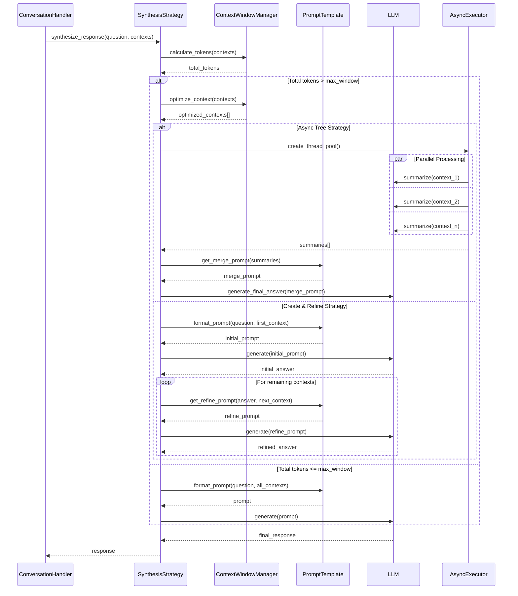

---

## PHẦN 4: THIẾT KẾ CHI TIẾT - BẠN THỨ BA

**Họ tên:** Lê Văn C
**Mã SV:** B21DCCN003
**Phụ trách:** Module LLM Management và Admin Interface

### 4.1. Thiết kế CSDL liên quan module

#### 4.1.1. Schema Model Management

```sql
CREATE TABLE llm_models (
    model_id UUID PRIMARY KEY DEFAULT gen_random_uuid(),
    model_name VARCHAR(255) NOT NULL UNIQUE,
    model_type VARCHAR(100), -- 'llama', 'qwen', 'openchat', etc.
    model_size VARCHAR(50), -- '7B', '13B', '70B'
    file_path TEXT NOT NULL,
    quantization VARCHAR(50), -- 'Q4_K_M', 'Q5_K_M', etc.
    context_window INTEGER,
    is_active BOOLEAN DEFAULT true,
    created_at TIMESTAMP DEFAULT CURRENT_TIMESTAMP
);

CREATE TABLE model_settings (
    setting_id UUID PRIMARY KEY DEFAULT gen_random_uuid(),
    model_id UUID REFERENCES llm_models(model_id),
    parameter_name VARCHAR(255),
    parameter_value TEXT,
    parameter_type VARCHAR(50) -- 'float', 'int', 'string', 'boolean'
);

CREATE TABLE admin_users (
    user_id UUID PRIMARY KEY DEFAULT gen_random_uuid(),
    username VARCHAR(255) UNIQUE NOT NULL,
    password_hash TEXT NOT NULL,
    role VARCHAR(50), -- 'super_admin', 'content_admin', 'viewer'
    created_at TIMESTAMP DEFAULT CURRENT_TIMESTAMP,
    last_login TIMESTAMP
);

CREATE TABLE admin_logs (
    log_id UUID PRIMARY KEY DEFAULT gen_random_uuid(),
    user_id UUID REFERENCES admin_users(user_id),
    action VARCHAR(255),
    target_type VARCHAR(100), -- 'model', 'document', 'setting'
    target_id VARCHAR(255),
    details JSONB,
    created_at TIMESTAMP DEFAULT CURRENT_TIMESTAMP
);
```

### 4.2. Thiết kế lớp thực thể

```python
@dataclass
class LLMModel:
    """Entity representing an LLM model"""
    model_id: str
    model_name: str
    model_type: str
    model_size: str
    file_path: str
    quantization: str
    context_window: int
    is_active: bool
    settings: Dict[str, Any]
    created_at: datetime

@dataclass
class AdminUser:
    """Entity representing an admin user"""
    user_id: str
    username: str
    role: str
    permissions: List[str]
    created_at: datetime
    last_login: Optional[datetime]
```

### 4.3. Chức năng 1: LLM Model Management

#### 4.3.1. Thiết kế giao diện

```
┌─────────────────────────────────────────────┐
│          LLM MODEL MANAGEMENT                │
├─────────────────────────────────────────────┤
│                                              │
│  Active Models:                             │
│  ┌────────────────────────────────────────┐ │
│  │ 🤖 Llama 3.1 - 8B                      │ │
│  │    Status: ✅ Active                   │ │
│  │    Context: 128k tokens                │ │
│  │    Quantization: Q4_K_M                │ │
│  │    [Configure] [Test] [Deactivate]     │ │
│  ├────────────────────────────────────────┤ │
│  │ 🤖 Qwen 2.5 - 3B                       │ │
│  │    Status: ✅ Active                   │ │
│  │    Context: 32k tokens                 │ │
│  │    Quantization: Q5_K_M                │ │
│  │    [Configure] [Test] [Deactivate]     │ │
│  └────────────────────────────────────────┘ │
│                                              │
│  Model Configuration:                       │
│  ┌────────────────────────────────────────┐ │
│  │ Temperature: [0.7 ━━━━●━━━━] 1.0       │ │
│  │ Max Tokens: [2048 ▼]                   │ │
│  │ Top P: [0.95 ━━━━━━━━●━] 1.0          │ │
│  │ Top K: [40 ▼]                          │ │
│  │ Repeat Penalty: [1.1 ━━●━━━━━] 2.0    │ │
│  │                                         │ │
│  │ [Save Settings] [Reset to Default]     │ │
│  └────────────────────────────────────────┘ │
│                                              │
│  [+ Add New Model] [Download Models]        │
│                                              │
└─────────────────────────────────────────────┘
```

#### 4.3.2. Thiết kế lớp chi tiết

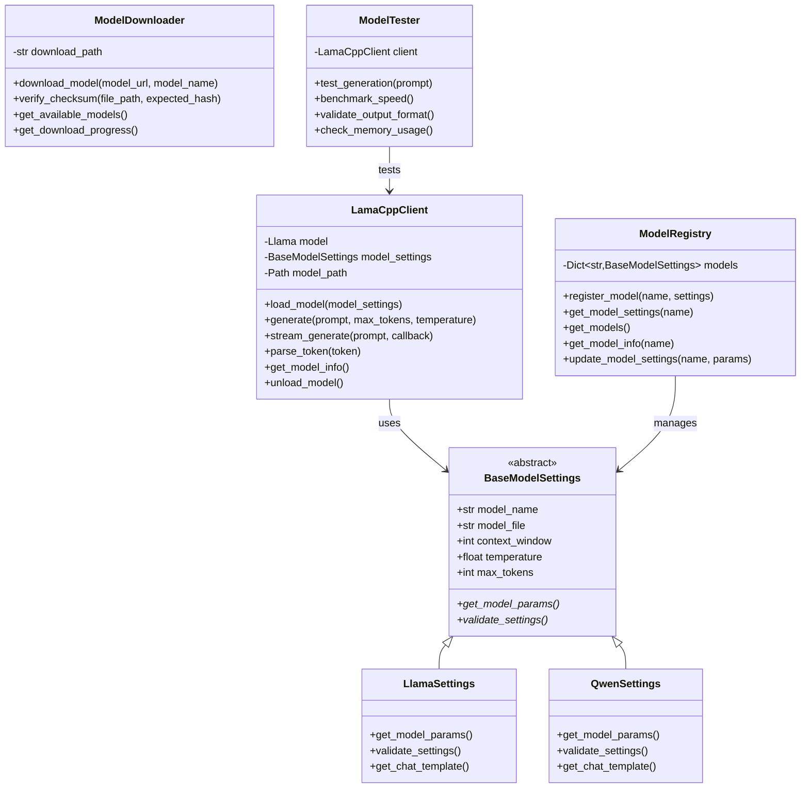

**Giải thích thiết kế:**
- **LamaCppClient**: Client chính để tương tác với LLM
- **ModelRegistry**: Quản lý registry của các model
- **BaseModelSettings**: Abstract class cho settings của model
- **ModelDownloader**: Xử lý download và verify model files
- **ModelTester**: Test và benchmark các model

#### 4.3.3. Biểu đồ hoạt động

```mermaid
activity
  start
  :Admin accesses model management;

  :Display available models;

  switch (Admin action?)
  case (Add new model)
    :Select model from repository;
    :Download model file;
    :Verify checksum;
    :Configure initial settings;
    :Test model generation;
    if (Test successful?) then (yes)
      :Save model configuration;
      :Activate model;
    else (no)
      :Show error;
      :Rollback changes;
    endif
  case (Configure model)
    :Load current settings;
    :Display configuration form;
    :Admin adjusts parameters;
    :Validate parameters;
    :Test with new settings;
    :Save configuration;
  case (Test model)
    :Load model;
    :Run benchmark tests;
    :Check memory usage;
    :Generate sample responses;
    :Display test results;
  endswitch

  :Log admin action;
  :Update model status;
  stop
```

#### 4.3.4. Biểu đồ tuần tự

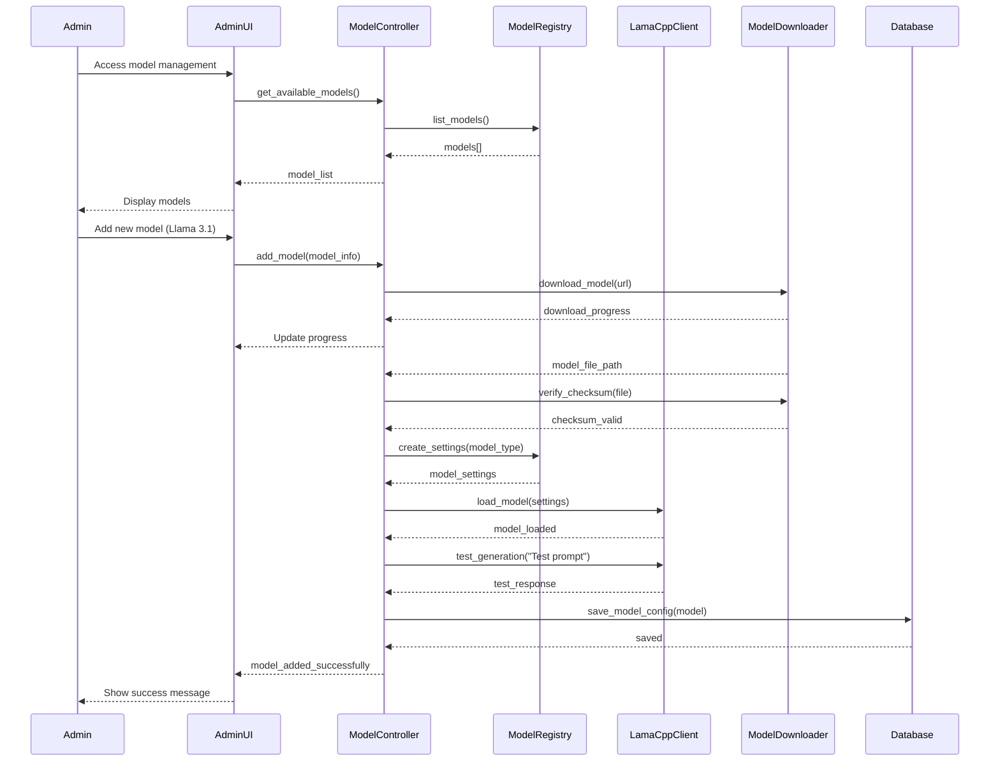

### 4.4. Chức năng 2: Admin Dashboard và System Monitoring

#### 4.4.1. Thiết kế giao diện

```
┌─────────────────────────────────────────────┐
│         ADMIN DASHBOARD - PTIT CHATBOT       │
├─────────────────────────────────────────────┤
│  📊 System Overview          🔄 Auto-refresh │
│  ┌────────────────────────────────────────┐ │
│  │ Active Users: 127    CPU Usage: 45%    │ │
│  │ Total Chats: 3,421   RAM: 8.2/16 GB    │ │
│  │ Avg Response: 2.3s   GPU: 65%          │ │
│  └────────────────────────────────────────┘ │
│                                              │
│  📈 Real-time Metrics:                      │
│  ┌────────────────────────────────────────┐ │
│  │     Requests per Minute                 │ │
│  │ 100 ┤     ╱╲                          │ │
│  │  75 ┤    ╱  ╲    ╱╲                   │ │
│  │  50 ┤   ╱    ╲__╱  ╲                  │ │
│  │  25 ┤__╱            ╲                 │ │
│  │   0 └────────────────────────          │ │
│  │     00:00  06:00  12:00  18:00  24:00  │ │
│  └────────────────────────────────────────┘ │
│                                              │
│  🗂️ Recent Activities:                      │
│  ┌────────────────────────────────────────┐ │
│  │ 10:23 - Admin added new document       │ │
│  │ 10:15 - Model Llama 3.1 activated      │ │
│  │ 09:45 - System backup completed        │ │
│  │ 09:30 - User feedback: 5 stars        │ │
│  └────────────────────────────────────────┘ │
│                                              │
│  Quick Actions:                             │
│  [📁 Manage Docs] [🤖 Models] [👥 Users]   │
│  [📊 Reports] [⚙️ Settings] [🔒 Logout]    │
│                                              │
└─────────────────────────────────────────────┘
```

#### 4.4.2. Thiết kế lớp chi tiết

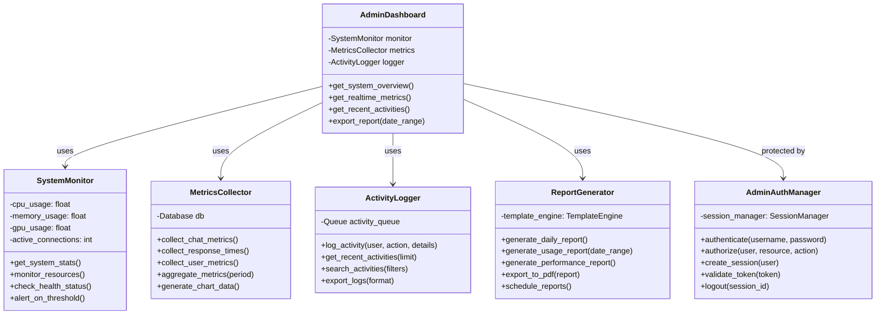

**Giải thích thiết kế:**
- **AdminDashboard**: Controller chính cho dashboard
- **SystemMonitor**: Giám sát tài nguyên hệ thống
- **MetricsCollector**: Thu thập và tổng hợp metrics
- **ActivityLogger**: Ghi log hoạt động admin
- **ReportGenerator**: Tạo báo cáo tự động
- **AdminAuthManager**: Quản lý authentication và authorization

#### 4.4.3. Biểu đồ hoạt động

```mermaid
activity
  start
  :Admin login;

  if (Valid credentials?) then (no)
    :Show error;
    stop
  else (yes)
    :Create session;
  endif

  :Load dashboard;

  fork
    :Fetch system metrics;
  fork again
    :Load recent activities;
  fork again
    :Calculate statistics;
  end fork

  :Display dashboard;

  while (Admin logged in?) is (yes)
    :Auto-refresh metrics;

    if (Admin action?) then (yes)
      switch (Action type?)
      case (View reports)
        :Generate report;
        :Display/Export;
      case (Manage documents)
        :Open document manager;
        :Process documents;
      case (Configure system)
        :Load settings;
        :Update configuration;
        :Apply changes;
      case (View logs)
        :Query activity logs;
        :Display filtered results;
      endswitch
    endif

    :Update dashboard;
    :Check for alerts;

    if (Critical alert?) then (yes)
      :Send notification;
      :Log incident;
    endif
  endwhile (no)

  :Logout;
  :Clear session;
  stop
```

#### 4.4.4. Biểu đồ tuần tự

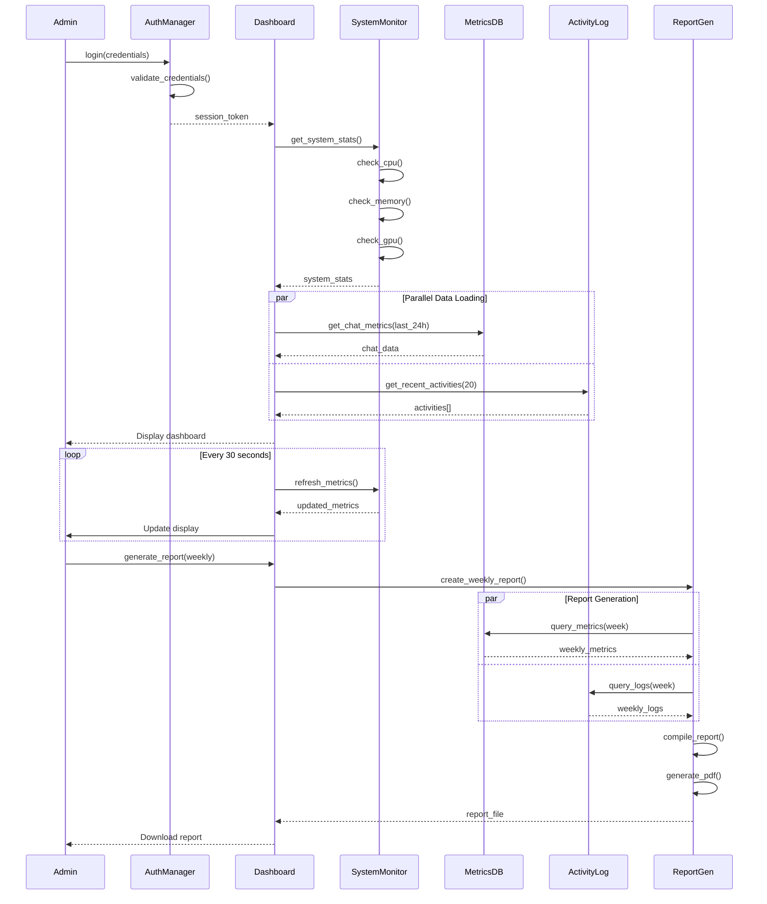

---

## PHẦN 5: TỔNG KẾT

### 5.1. Phân công công việc

| Thành viên | Module phụ trách | Công việc chính |
|------------|------------------|-----------------|
| Nguyễn Văn A | RAG Core & Vector DB | - Xây dựng Vector Database<br>- Implement similarity search<br>- Document processing pipeline |
| Trần Thị B | Chat Interface & Conversation | - Giao diện chat Streamlit<br>- WebSocket real-time<br>- Context synthesis strategies |
| Lê Văn C | LLM & Admin | - LLM client management<br>- Admin dashboard<br>- System monitoring |

### 5.2. Timeline dự kiến

1. **Tuần 1-2:** Setup môi trường, cài đặt dependencies
2. **Tuần 3-4:** Implement core modules (Vector DB, LLM Client)
3. **Tuần 5-6:** Xây dựng Chat Interface và WebSocket
4. **Tuần 7-8:** Develop Admin Dashboard và monitoring
5. **Tuần 9-10:** Integration testing và optimization
6. **Tuần 11-12:** User testing và documentation

### 5.3. Các rủi ro và giải pháp

1. **Performance issues với LLM lớn:**
   - Giải pháp: Sử dụng quantization, implement caching

2. **Context overflow:**
   - Giải pháp: Implement multiple synthesis strategies

3. **Real-time latency:**
   - Giải pháp: Streaming response, async processing

4. **Accuracy của RAG:**
   - Giải pháp: Fine-tune embeddings, improve chunking strategy

---

**Ghi chú:** Báo cáo này được thiết kế cho hệ thống Chatbot tư vấn thông tin trường PTIT sử dụng kiến trúc RAG với các công nghệ open-source hiện đại. Thiết kế có thể được điều chỉnh dựa trên feedback và yêu cầu cụ thể của dự án.
