# BÁO CÁO THIẾT KẾ MODULE 2: CHATBOT APPLICATION & RAG MODULE

**Sinh viên thực hiện:** [Tên bạn]
**Mã sinh viên:** [MSSV]
**Lớp:** [Tên lớp]

---

## 1. TỔNG QUAN MODULE

### 1.1. Vai trò trong hệ thống
Module 2 đóng vai trò là **trung tâm xử lý RAG (Retrieval-Augmented Generation)** và cung cấp API chatbot cho người dùng cuối. Module này:
- Nhận câu hỏi từ Client 2 (Customer)
- Tìm kiếm thông tin liên quan từ vector database
- Tổng hợp context và sinh câu trả lời qua LLM
- Đồng bộ documents từ Server 1
- Trả kết quả về Client 2

### 1.2. Chức năng chính
Module hoạt động như một **RAG Pipeline** bao gồm:
- **Chức năng 1**: User Management (Quản lý customer users)
- **Chức năng 2**: RAG System (Chat với user, quản lý vector DB, đồng bộ documents)

### 1.3. Công nghệ sử dụng
- **Backend Framework**: FastAPI
- **Vector Database**: ChromaDB
- **LLM**: OpenAI API / Local LLM
- **Embedding Model**: sentence-transformers
- **Database**: PostgreSQL (conversations)

---

## 2. THIẾT KẾ CƠ SỞ DỮ LIỆU

### 2.1. Vector Database Schema (ChromaDB)

#### Collection: `ptit_knowledge_base`
```python
{
    "id": "doc_001",
    "document": "Nội dung văn bản gốc",
    "metadata": {
        "source": "ptit_tuyen_sinh.pdf",
        "category": "tuyen_sinh",
        "chunk_index": 0
    },
    "embedding": [0.123, 0.456, ...] # Vector 768 chiều
}
```

**Giải thích:**
- `id`: Unique identifier cho mỗi chunk
- `document`: Văn bản đã được chunking
- `metadata`: Thông tin nguồn gốc, danh mục
- `embedding`: Vector đại diện ngữ nghĩa

### 2.2. User & Conversation Schema (PostgreSQL)

#### Table: `users`
```sql
CREATE TABLE users (
    user_id VARCHAR(36) PRIMARY KEY,
    username VARCHAR(100) UNIQUE NOT NULL,
    email VARCHAR(255) UNIQUE NOT NULL,
    full_name VARCHAR(255),
    created_at TIMESTAMP DEFAULT CURRENT_TIMESTAMP,
    updated_at TIMESTAMP DEFAULT CURRENT_TIMESTAMP,
    is_active BOOLEAN DEFAULT TRUE
);
```

#### Table: `conversations`
```sql
CREATE TABLE conversations (
    conversation_id VARCHAR(36) PRIMARY KEY,
    user_id VARCHAR(36) NOT NULL REFERENCES users(user_id),
    created_at TIMESTAMP DEFAULT CURRENT_TIMESTAMP
);
```

#### Table: `messages`
```sql
CREATE TABLE messages (
    message_id VARCHAR(36) PRIMARY KEY,
    conversation_id VARCHAR(36) REFERENCES conversations(conversation_id),
    role VARCHAR(10) NOT NULL, -- 'user' or 'assistant'
    content TEXT NOT NULL,
    created_at TIMESTAMP DEFAULT CURRENT_TIMESTAMP
);
```

#### Table: `responses`
```sql
CREATE TABLE responses (
    response_id VARCHAR(36) PRIMARY KEY,
    conversation_id VARCHAR(36) REFERENCES conversations(conversation_id),
    answer TEXT NOT NULL,
    created_at TIMESTAMP DEFAULT CURRENT_TIMESTAMP
);
```

#### Table: `response_documents` (Bảng trung gian)
```sql
CREATE TABLE response_documents (
    response_id VARCHAR(36) REFERENCES responses(response_id),
    document_id VARCHAR(255) NOT NULL, -- ID từ ChromaDB
    relevance_score FLOAT,
    ranking INT,
    PRIMARY KEY (response_id, document_id)
);
```

**Giải thích bảng trung gian:**
- `response_id`: FK tới bảng responses
- `document_id`: ID của document trong ChromaDB
- `relevance_score`: Điểm tương đồng cosine (0-1)
- `ranking`: Thứ hạng trong top-k results (1, 2, 3...)

---

## 3. THIẾT KẾ LỚP THỰC THỂ

### 3.1. Entity Classes

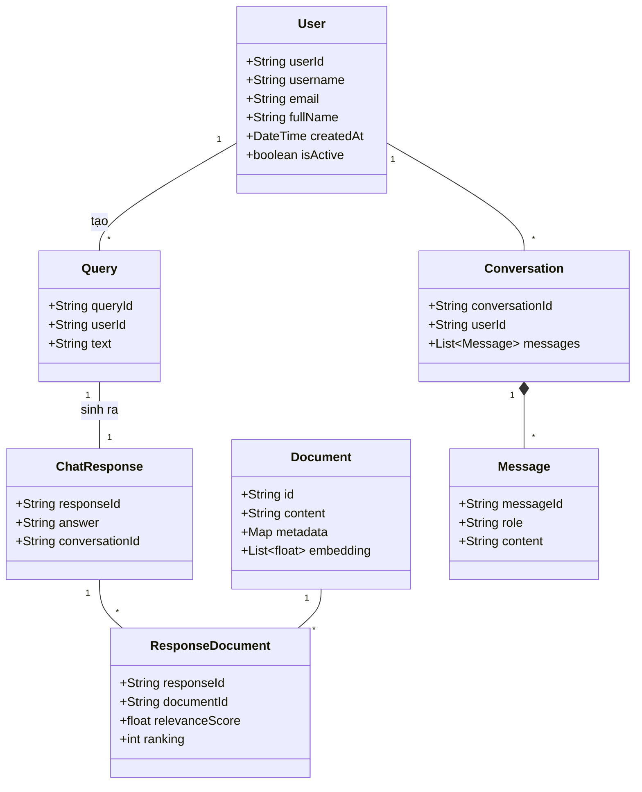

### 3.2. Mô tả quan hệ

**Quan hệ chính:**

1. **User - Conversation (1-N)**:
   - Một user có nhiều conversations
   - Mỗi conversation thuộc về 1 user

2. **Conversation - Message (1-N, Composition)**:
   - Một conversation chứa nhiều messages
   - Message không tồn tại độc lập ngoài conversation (composition)

3. **User - Query (1-N)**:
   - Một user gửi nhiều queries (câu hỏi)
   - Mỗi query được tạo bởi 1 user

4. **Query - ChatResponse (1-1)**:
   - Mỗi query sinh ra 1 response
   - Response là kết quả trả lời của query

5. **ChatResponse - Document (N-N qua ResponseDocument)**:
   - **Bảng trung gian**: `ResponseDocument`
   - Một response tham chiếu nhiều documents (top-k retrieval results)
   - Một document có thể được dùng trong nhiều responses
   - Lưu thêm: `relevanceScore` (độ tương đồng), `ranking` (thứ hạng)

6. **ResponseDocument (Association Class)**:
   - Link giữa ChatResponse và Document
   - Chứa metadata: điểm relevance, thứ tự ranking
   - Giúp tracking documents nào được dùng cho response nào

**Luồng dữ liệu:**
```
User → Query → [RAG Pipeline] → Vector Search → Document
                                      ↓
                                ChatResponse ← ResponseDocument (link docs)
                                      ↓
                             Conversation → Message (lưu user query + bot answer)
```

---

## 4. KIẾN TRÚC HỆ THỐNG

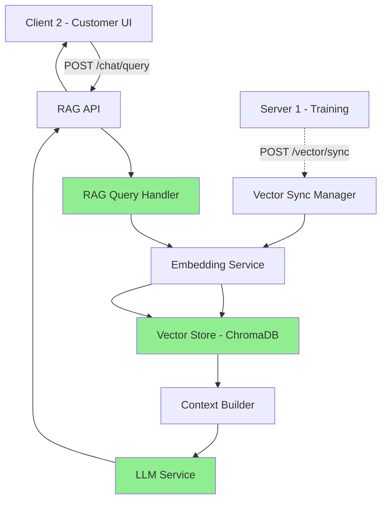

---

# CHỨC NĂNG 1: USER MANAGEMENT (QUẢN LÝ CUSTOMER USERS)

## 5.1. Thiết kế giao diện

### 5.1.1. Server Backend API

#### Endpoint: `POST /api/v1/users` (Tạo user mới)

**Request:**
```json
{
    "username": "nguyenvana",
    "email": "nguyenvana@ptit.edu.vn",
    "full_name": "Nguyễn Văn A"
}
```

**Response:**
```json
{
    "success": true,
    "data": {
        "user_id": "user_123",
        "username": "nguyenvana",
        "email": "nguyenvana@ptit.edu.vn",
        "full_name": "Nguyễn Văn A",
        "created_at": "2025-01-15T10:30:00Z",
        "is_active": true
    }
}
```

#### Endpoint: `GET /api/v1/users/{user_id}` (Lấy thông tin user)

**Response:**
```json
{
    "success": true,
    "data": {
        "user_id": "user_123",
        "username": "nguyenvana",
        "email": "nguyenvana@ptit.edu.vn",
        "full_name": "Nguyễn Văn A",
        "created_at": "2025-01-15T10:30:00Z",
        "is_active": true
    }
}
```

#### Endpoint: `PUT /api/v1/users/{user_id}` (Cập nhật user)

**Request:**
```json
{
    "full_name": "Nguyễn Văn A (Updated)",
    "email": "nguyenvana_new@ptit.edu.vn"
}
```

#### Endpoint: `DELETE /api/v1/users/{user_id}` (Xóa/vô hiệu hóa user)

**Response:**
```json
{
    "success": true,
    "message": "User deactivated successfully"
}
```

### 5.1.2. Admin UI (Lớp ảo - Module 3)

**Giao diện quản lý users:**

```
┌──────────────────────────────────────────────┐
│  PTIT Admin - User Management               │
├──────────────────────────────────────────────┤
│                                              │
│  👥 Users List                               │
│  ┌────────────────────────────────────────┐ │
│  │ ID      Username    Email       Status │ │
│  │ user_1  nguyenvana  nva@ptit... Active │ │
│  │ user_2  tranthib    ttb@ptit... Active │ │
│  │ user_3  levanc      lvc@ptit... Inactive│ │
│  └────────────────────────────────────────┘ │
│                                              │
│  [Add User] [Search] [Export]               │
└──────────────────────────────────────────────┘
```

## 5.2. Thiết kế lớp chi tiết

### 5.2.1. Class Diagram

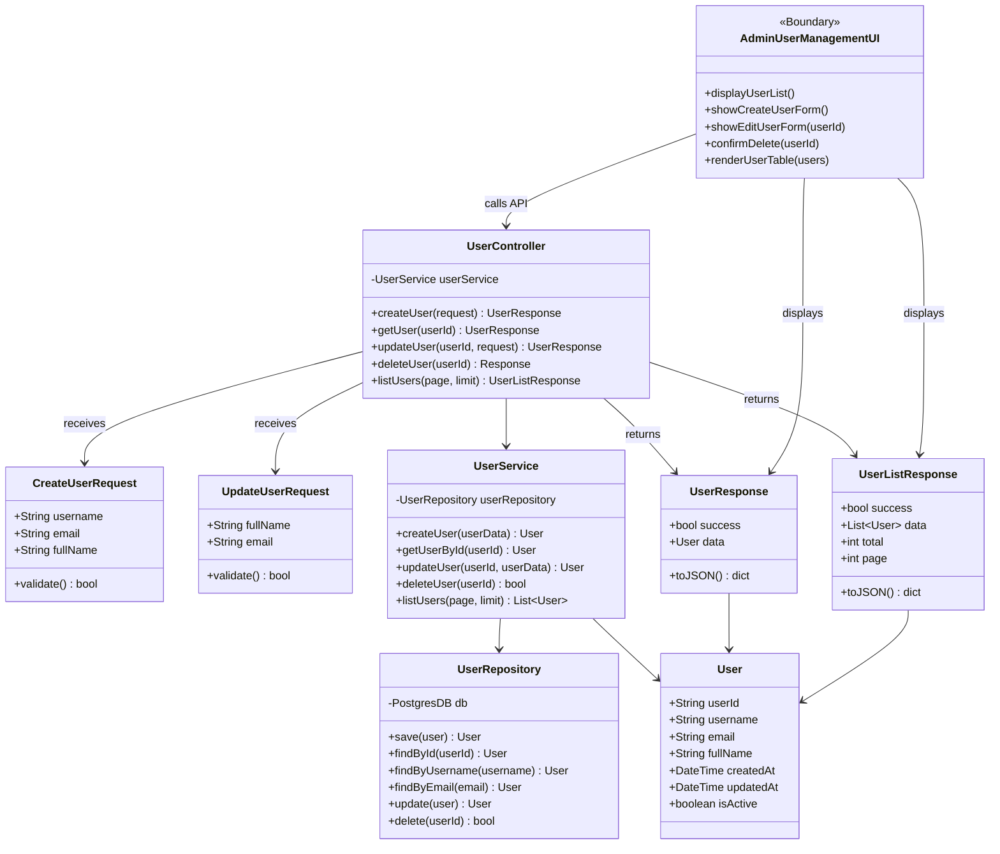

### 5.2.2. Diễn giải thiết kế

**Tại sao có các lớp này:**

1. **AdminUserManagementUI** (Boundary - Lớp giao diện):
   - **Lý do**: Giao diện web để admin quản lý users (Boundary class trong MVC)
   - **Trách nhiệm**: Render HTML, handle user interactions, gọi API
   - **Phương thức**:
     - `displayUserList()` - hiển thị danh sách users
     - `showCreateUserForm()` - hiển thị form tạo user
     - `showEditUserForm()` - hiển thị form sửa user
     - `confirmDelete()` - hiển thị popup xác nhận xóa
     - `renderUserTable()` - render bảng users

2. **UserController** (Controller):
   - **Lý do**: HTTP layer cho user management (MVC pattern)
   - **Trách nhiệm**: Handle CRUD requests, route đến service
   - **Phương thức**: `createUser()`, `getUser()`, `updateUser()`, `deleteUser()`, `listUsers()`

3. **CreateUserRequest** (Request DTO):
   - **Lý do**: Encapsulate dữ liệu tạo user từ HTTP request
   - **Trách nhiệm**: Validate input (username, email format, required fields)
   - **Phương thức**: `validate()` - kiểm tra dữ liệu hợp lệ

3. **UpdateUserRequest** (Request DTO):
   - **Lý do**: Encapsulate dữ liệu cập nhật user
   - **Trách nhiệm**: Validate input khi update (email format, optional fields)
   - **Phương thức**: `validate()` - kiểm tra dữ liệu hợp lệ

4. **UserService** (Service):
   - **Lý do**: Business logic cho user operations (Service pattern)
   - **Trách nhiệm**: Validate business rules, orchestrate operations
   - **Phương thức**: `createUser()`, `getUserById()`, `updateUser()`, `deleteUser()`

5. **UserRepository** (Repository):
   - **Lý do**: Data access layer (Repository pattern)
   - **Trách nhiệm**: CRUD operations với PostgreSQL
   - **Phương thức**: `save()`, `findById()`, `findByUsername()`, `update()`, `delete()`

6. **User** (Entity):
   - **Lý do**: Domain entity
   - **Trách nhiệm**: Represent user data trong domain model

7. **UserResponse** (Response DTO):
   - **Lý do**: Standardized response cho single user
   - **Trách nhiệm**: Serialize user data thành JSON cho client
   - **Phương thức**: `toJSON()` - convert sang JSON format

8. **UserListResponse** (Response DTO):
   - **Lý do**: Standardized response cho danh sách users
   - **Trách nhiệm**: Serialize list users + pagination info
   - **Phương thức**: `toJSON()` - convert sang JSON format

## 5.3. Biểu đồ hoạt động

### 5.3.1. Tạo User (Create)

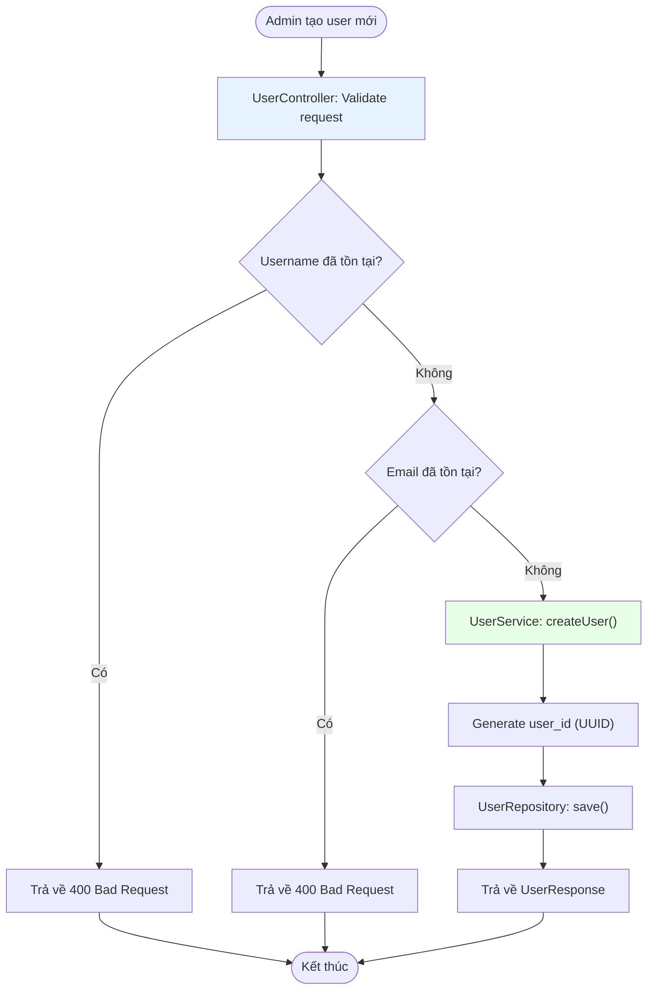

### 5.3.2. Cập nhật User (Update)

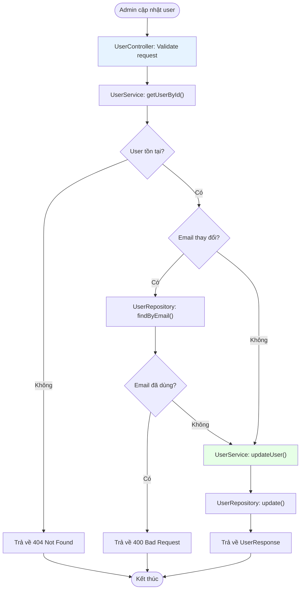

### 5.3.3. Xóa User (Delete)

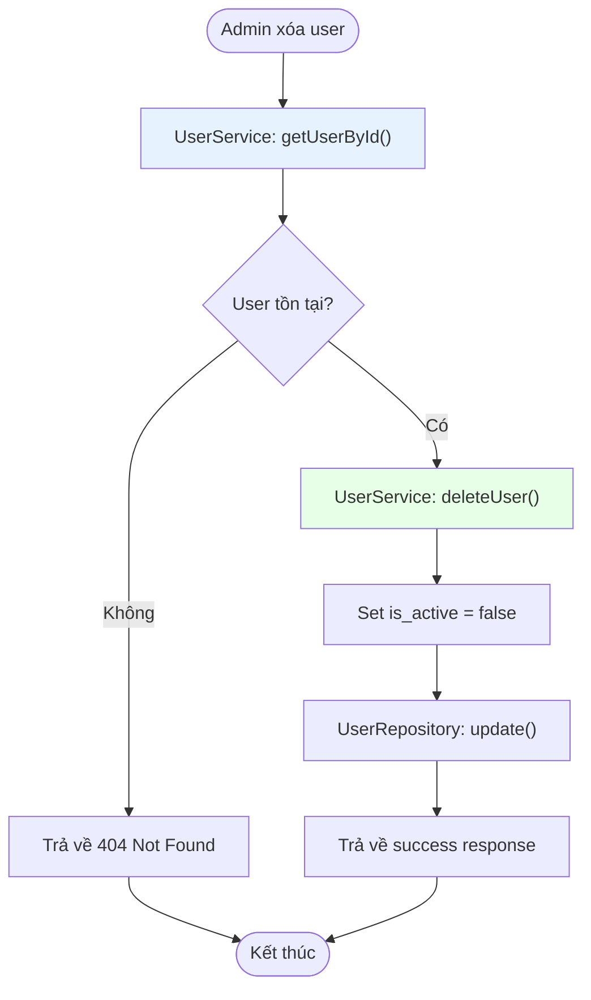

## 5.4. Biểu đồ tuần tự

### 5.4.1. Tạo User (Create)

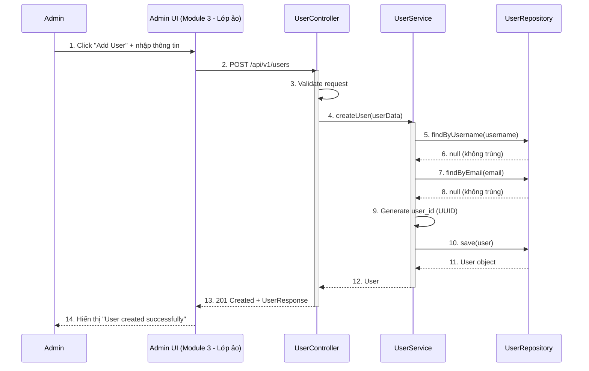

**Mô tả các bước:**
1. Admin nhập username, email, full_name vào form
2. Admin UI gửi POST request tới UserController
3. Controller validate dữ liệu đầu vào (required fields, format)
4. Controller gọi UserService để xử lý business logic
5-6. Service kiểm tra username đã tồn tại chưa
7-8. Service kiểm tra email đã tồn tại chưa
9. Service tạo UUID cho user_id
10-11. Repository lưu user vào PostgreSQL
12. Service trả User object về Controller
13. Controller wrap trong UserResponse và trả về
14. UI hiển thị thông báo thành công

### 5.4.2. Cập nhật User (Update)

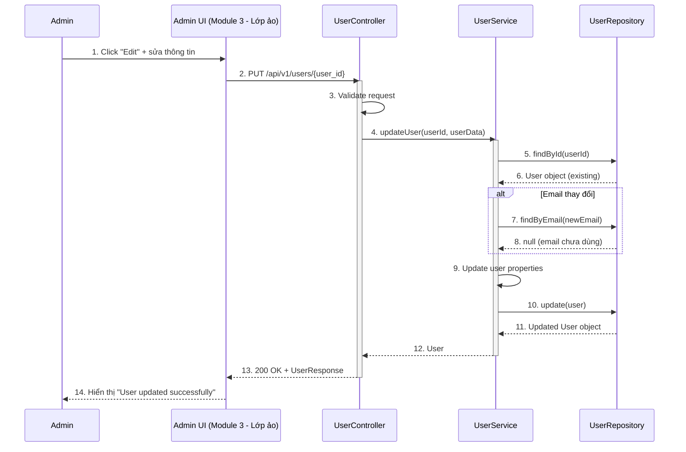

**Mô tả các bước:**
1. Admin click Edit user và sửa thông tin
2. Admin UI gửi PUT request với user_id
3. Controller validate dữ liệu (format, allowed fields)
4. Controller gọi Service để update
5-6. Service load user hiện tại từ database
7-8. Nếu email thay đổi, kiểm tra email mới chưa dùng
9. Service cập nhật các trường được phép (full_name, email)
10-11. Repository update user trong database
12. Service trả User object đã update
13. Controller trả 200 OK + UserResponse
14. UI hiển thị thông báo cập nhật thành công

### 5.4.3. Xóa User (Delete)

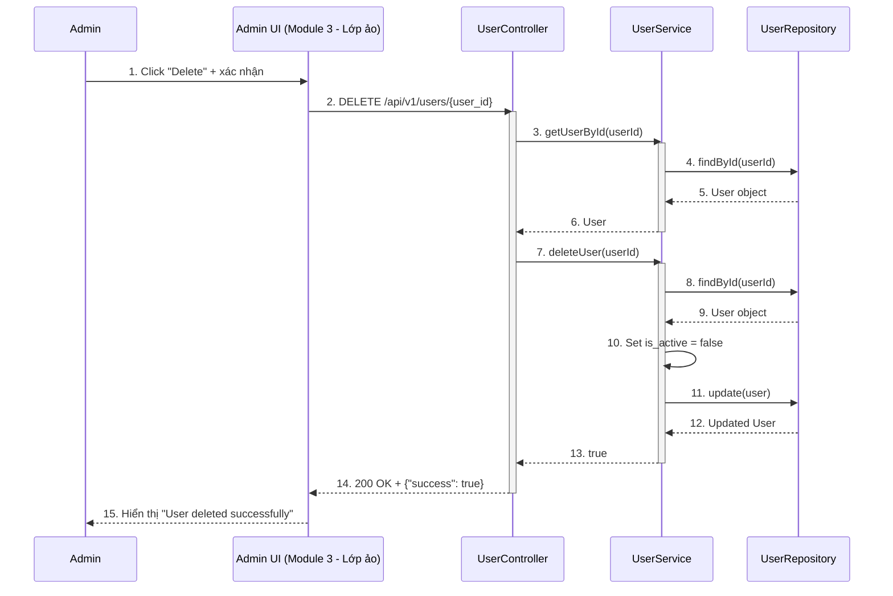

**Mô tả các bước:**
1. Admin click Delete và xác nhận trong popup
2. Admin UI gửi DELETE request với user_id
3. Controller gọi getUserById() để kiểm tra user tồn tại
4-5. Repository tìm user trong database
6. Service trả User object (hoặc throw 404 nếu không tồn tại)
7. Controller gọi deleteUser() để thực hiện soft delete
8-9. Service load lại user từ database
10. Service set is_active = false (soft delete, giữ data)
11-12. Repository update user trong database
13. Service trả true (success)
14. Controller trả 200 OK
15. UI hiển thị user đã bị xóa thành công

---

# CHỨC NĂNG 2: RAG SYSTEM (CHAT, QUẢN LÝ VECTOR DB, ĐỒNG BỘ DOCUMENTS)

## 5.5. Thiết kế giao diện

### 5.5.1. Server Backend API

#### A. Chat API

**Endpoint: `POST /api/v1/chat/query`**

**Request:**
```json
{
    "query": "Học phí ngành CNTT năm 2025 là bao nhiêu?",
    "user_id": "user_123",
    "conversation_id": "conv_456"
}
```

**Response:**
```json
{
    "success": true,
    "data": {
        "answer": "Học phí ngành Công nghệ Thông tin năm 2025 là 12.000.000 VNĐ/năm...",
        "conversation_id": "conv_456",
        "sources": [
            {
                "doc_id": "doc_001",
                "content": "Học phí các ngành năm 2025: CNTT: 12tr...",
                "source": "tuyen_sinh_2025.pdf"
            }
        ]
    }
}
```

#### B. Vector Database Statistics API

**Endpoint: `GET /api/v1/vector/stats`**

**Response:**
```json
{
    "success": true,
    "data": {
        "total_documents": 10245,
        "collections": [
            {
                "name": "ptit_knowledge_base",
                "count": 10245,
                "categories": {
                    "tuyen_sinh": 3420,
                    "hoc_phi": 1250,
                    "chuong_trinh_dao_tao": 5575
                }
            }
        ]
    }
}
```

#### C. Document Sync API (Server-to-Server)

**Endpoint: `POST /api/v1/vector/sync`**

**Request từ Server 1:**
```json
{
    "source": "server1_training",
    "operation": "upsert",
    "documents": [
        {
            "id": "doc_001",
            "content": "Nội dung tài liệu...",
            "metadata": {
                "source": "file.pdf",
                "category": "tuyen_sinh"
            }
        }
    ]
}
```

**Response:**
```json
{
    "success": true,
    "data": {
        "synced_count": 145,
        "total_vectors": 10390,
        "sync_time_ms": 3250
    }
}
```

### 5.5.2. Client UI (Lớp ảo - Module 3)

#### A. Customer Chat UI

**Giao diện chat:**

```
┌────────────────────────────────────────┐
│  PTIT Chatbot - Tư vấn sinh viên      │
├────────────────────────────────────────┤
│                                        │
│  User: Học phí CNTT 2025 bao nhiêu?   │
│                                        │
│  Bot: Học phí ngành Công nghệ Thông   │
│       tin năm 2025 là 12.000.000      │
│       VNĐ/năm...                      │
│                                        │
│       📄 Nguồn: tuyen_sinh_2025.pdf   │
│                                        │
├────────────────────────────────────────┤
│  [Nhập câu hỏi...]            [Gửi]  │
└────────────────────────────────────────┘
```

#### B. Admin Vector Dashboard UI

**Giao diện dashboard:**

```
┌──────────────────────────────────────────────┐
│  PTIT Admin - Vector Database Dashboard    │
├──────────────────────────────────────────────┤
│                                              │
│  📊 Statistics                               │
│  ├─ Total Documents: 10,245                 │
│  └─ Collections: 1                          │
│                                              │
│  📁 Categories                               │
│  ├─ Tuyển sinh: 3,420 (33%)                │
│  ├─ Học phí: 1,250 (12%)                   │
│  └─ Đào tạo: 5,575 (55%)                   │
│                                              │
│  ⚙️ Actions                                  │
│  [View Documents] [Refresh Stats]           │
└──────────────────────────────────────────────┘
```

## 5.6. Thiết kế lớp chi tiết

### 5.6.1. Class Diagram

```mermaid
classDiagram
    %% ========== CHAT FUNCTIONALITY ==========
    class CustomerChatUI {
        <<Boundary>>
        +displayChatInterface()
        +sendMessage(query)
        +displayAnswer(response)
        +displaySources(sources)
        +loadHistory(conversationId)
        +renderChatBubble(message)
    }

    class ChatController {
        -RAGQueryHandler ragHandler
        +postQuery(request) ChatResponse
        +getConversationHistory(userId, convId) ConversationHistoryResponse
    }

    class QueryRequest {
        +String query
        +String userId
        +String conversationId
        +validate() bool
    }

    class RAGQueryHandler {
        -VectorStore vectorStore
        -EmbeddingService embeddingService
        -LLMService llmService
        -ContextBuilder contextBuilder
        -ConversationManager conversationManager
        +processQuery(query: Query) ChatResponse
    }

    class Query {
        +String queryId
        +String userId
        +String conversationId
        +String text
    }

    class ChatResponse {
        +bool success
        +String answer
        +String conversationId
        +List~SourceDocument~ sources
        +toJSON() dict
    }

    class SourceDocument {
        +String docId
        +String content
        +String source
        +float relevanceScore
    }

    class ConversationHistoryResponse {
        +bool success
        +List~Message~ messages
        +String conversationId
        +toJSON() dict
    }

    class ContextBuilder {
        -ConversationManager convManager
        +build(query, documents, convId) String
    }

    class ConversationManager {
        -PostgresDB db
        +saveMessage(convId, message) void
        +getHistory(convId, limit) List~Message~
        +createConversation(userId) String
    }

    %% ========== VECTOR STATS FUNCTIONALITY ==========
    class AdminVectorDashboardUI {
        <<Boundary>>
        +displayDashboard()
        +showCollectionStats()
        +refreshStats()
        +renderStatsTable(stats)
        +searchVectors(query)
    }

    class VectorController {
        -VectorStatsService statsService
        +getStats() VectorStatsResponse
        +postSearchVectors(request) VectorSearchResponse
    }

    class VectorStatsService {
        -VectorStore vectorStore
        +getStatistics() VectorStats
        +searchVectors(query, topK) List~Document~
    }

    class VectorStats {
        +int totalDocuments
        +int totalCollections
        +List~CollectionInfo~ collections
        +toJSON() dict
    }

    class CollectionInfo {
        +String name
        +int documentCount
        +int dimension
    }

    class VectorStatsResponse {
        +bool success
        +VectorStats stats
        +toJSON() dict
    }

    class VectorSearchResponse {
        +bool success
        +List~Document~ results
        +toJSON() dict
    }

    %% ========== DOCUMENT SYNC FUNCTIONALITY ==========
    class SyncController {
        -VectorSyncManager syncManager
        +postSync(request) SyncResponse
    }

    class SyncRequest {
        +List~String~ documentUrls
        +String collectionName
        +dict metadata
        +validate() bool
    }

    class VectorSyncManager {
        -VectorStore vectorStore
        -DocumentProcessor processor
        -EmbeddingService embeddingService
        +syncDocuments(urls, collection) SyncResult
    }

    class DocumentProcessor {
        -ChunkingStrategy strategy
        +processDocument(url) Document
        +splitIntoChunks(document) List~Chunk~
    }

    class ChunkingStrategy {
        <<interface>>
        +chunk(text, chunkSize) List~String~
    }

    class SentenceChunker {
        +chunk(text, chunkSize) List~String~
    }

    class TokenChunker {
        +chunk(text, chunkSize) List~String~
    }

    class SyncResponse {
        +bool success
        +int documentsProcessed
        +int chunksCreated
        +List~String~ errors
        +toJSON() dict
    }

    %% ========== SHARED COMPONENTS ==========
    class VectorStore {
        -ChromaDB client
        +search(embedding, topK) List~Document~
        +insert(documents, embeddings) void
        +getStats() dict
        +getCollections() List~String~
    }

    class EmbeddingService {
        -SentenceTransformer model
        +embed(text) List~float~
        +batchEmbed(texts) List~List~float~~
    }

    class LLMService {
        -OpenAI client
        +generate(prompt) String
    }

    %% ========== RELATIONSHIPS - CHAT ==========
    CustomerChatUI --> ChatController : calls API
    ChatController --> QueryRequest : receives
    ChatController --> RAGQueryHandler
    RAGQueryHandler --> Query
    RAGQueryHandler --> ChatResponse : returns
    ChatController --> ChatResponse : returns
    ChatController --> ConversationHistoryResponse : returns
    ChatResponse --> SourceDocument
    RAGQueryHandler --> ContextBuilder
    RAGQueryHandler --> ConversationManager
    CustomerChatUI --> ChatResponse : displays
    CustomerChatUI --> ConversationHistoryResponse : displays
    RAGQueryHandler --> VectorStore
    RAGQueryHandler --> EmbeddingService
    RAGQueryHandler --> LLMService

    %% ========== RELATIONSHIPS - VECTOR STATS ==========
    AdminVectorDashboardUI --> VectorController : calls API
    VectorController --> VectorStatsService
    VectorStatsService --> VectorStore
    VectorStatsService --> VectorStats : returns
    VectorStats --> CollectionInfo
    VectorController --> VectorStatsResponse : returns
    VectorController --> VectorSearchResponse : returns
    AdminVectorDashboardUI --> VectorStatsResponse : displays
    VectorStatsService --> EmbeddingService

    %% ========== RELATIONSHIPS - DOCUMENT SYNC ==========
    SyncController --> SyncRequest : receives
    SyncController --> VectorSyncManager
    VectorSyncManager --> DocumentProcessor
    VectorSyncManager --> VectorStore
    VectorSyncManager --> EmbeddingService
    DocumentProcessor --> ChunkingStrategy
    ChunkingStrategy <|.. SentenceChunker : implements
    ChunkingStrategy <|.. TokenChunker : implements
    SyncController --> SyncResponse : returns
```

### 5.6.2. Diễn giải thiết kế

**Tại sao có các lớp này:**

#### A. CHAT FUNCTIONALITY

1. **CustomerChatUI** (Boundary - Lớp giao diện):
   - **Lý do**: Giao diện web chat cho customer (Boundary class)
   - **Trách nhiệm**: Render chat interface, handle user input, display responses
   - **Phương thức**:
     - `displayChatInterface()` - hiển thị giao diện chat
     - `sendMessage()` - gửi câu hỏi đến server
     - `displayAnswer()` - hiển thị câu trả lời từ bot
     - `displaySources()` - hiển thị nguồn tài liệu tham khảo
     - `loadHistory()` - load lịch sử chat
     - `renderChatBubble()` - render từng message bubble

2. **ChatController** (Controller):
   - **Lý do**: HTTP layer cho chat operations (MVC pattern)
   - **Trách nhiệm**: Handle chat requests, route đến RAG handler
   - **Phương thức**: `postQuery()`, `getConversationHistory()`

3. **QueryRequest** (Request DTO):
   - **Lý do**: Encapsulate chat query từ HTTP request
   - **Trách nhiệm**: Validate input (query text required, userId, conversationId)
   - **Phương thức**: `validate()` - kiểm tra query không empty

4. **RAGQueryHandler** (Facade):
   - **Lý do**: Điều phối toàn bộ RAG pipeline (Facade pattern)
   - **Trách nhiệm**: Orchestrate: embed → search → build context → generate
   - **Phương thức**: `processQuery()` - main RAG workflow

5. **Query** (Value Object):
   - **Lý do**: Domain object đại diện cho câu hỏi
   - **Trách nhiệm**: Encapsulate query information, immutable

6. **ChatResponse** (Response DTO):
   - **Lý do**: Standardized response cho chat query
   - **Trách nhiệm**: Serialize answer + sources thành JSON
   - **Phương thức**: `toJSON()` - convert sang JSON format

7. **SourceDocument** (DTO):
   - **Lý do**: Represent document source trong response
   - **Trách nhiệm**: Chứa thông tin document được retrieve (id, content, source file, score)

8. **ConversationHistoryResponse** (Response DTO):
   - **Lý do**: Standardized response cho lịch sử hội thoại
   - **Trách nhiệm**: Serialize conversation history thành JSON
   - **Phương thức**: `toJSON()`

9. **ContextBuilder** (Builder):
   - **Lý do**: Build prompt cho LLM (Builder pattern)
   - **Trách nhiệm**: Format documents + conversation history → final prompt
   - **Phương thức**: `build()` - tạo prompt string

10. **ConversationManager** (Repository):
    - **Lý do**: Quản lý conversation persistence (Repository pattern)
    - **Trách nhiệm**: CRUD operations cho conversations với PostgreSQL
    - **Phương thức**: `saveMessage()`, `getHistory()`, `createConversation()`

#### B. VECTOR STATS FUNCTIONALITY

11. **AdminVectorDashboardUI** (Boundary - Lớp giao diện):
    - **Lý do**: Giao diện admin dashboard cho thống kê vector DB (Boundary class)
    - **Trách nhiệm**: Hiển thị thống kê, search vectors, refresh data
    - **Phương thức**:
      - `displayDashboard()` - hiển thị dashboard
      - `showCollectionStats()` - hiển thị stats từng collection
      - `refreshStats()` - làm mới dữ liệu
      - `renderStatsTable()` - render bảng thống kê
      - `searchVectors()` - tìm kiếm vectors

12. **VectorController** (Controller):
    - **Lý do**: HTTP layer cho vector stats operations (MVC pattern)
    - **Trách nhiệm**: Handle stats requests, route đến service
    - **Phương thức**: `getStats()`, `postSearchVectors()`

13. **VectorStatsService** (Service):
    - **Lý do**: Business logic cho việc lấy thống kê vector DB
    - **Trách nhiệm**: Gọi VectorStore để lấy stats, search vectors
    - **Phương thức**: `getStatistics()`, `searchVectors()`

14. **VectorStats** (Value Object):
    - **Lý do**: Encapsulate thông tin thống kê vector DB
    - **Trách nhiệm**: Chứa total documents, collections, collection info
    - **Phương thức**: `toJSON()`

15. **CollectionInfo** (Value Object):
    - **Lý do**: Represent thông tin từng collection
    - **Trách nhiệm**: Chứa name, document count, dimension

16. **VectorStatsResponse** (Response DTO):
    - **Lý do**: Standardized response cho stats request
    - **Trách nhiệm**: Serialize stats thành JSON
    - **Phương thức**: `toJSON()`

17. **VectorSearchResponse** (Response DTO):
    - **Lý do**: Standardized response cho vector search
    - **Trách nhiệm**: Serialize search results thành JSON
    - **Phương thức**: `toJSON()`

#### C. DOCUMENT SYNC FUNCTIONALITY

18. **SyncController** (Controller):
    - **Lý do**: HTTP layer cho document sync operations (MVC pattern)
    - **Trách nhiệm**: Handle sync requests từ Server 1, route đến manager
    - **Phương thức**: `postSync()`

19. **SyncRequest** (Request DTO):
    - **Lý do**: Encapsulate document sync request từ Server 1
    - **Trách nhiệm**: Validate input (documentUrls, collectionName)
    - **Phương thức**: `validate()`

20. **VectorSyncManager** (Facade):
    - **Lý do**: Điều phối toàn bộ document sync pipeline (Facade pattern)
    - **Trách nhiệm**: Orchestrate: process → chunk → embed → insert
    - **Phương thức**: `syncDocuments()`

21. **DocumentProcessor** (Service):
    - **Lý do**: Xử lý documents (load, clean, chunk)
    - **Trách nhiệm**: Load document từ URL, split thành chunks
    - **Phương thức**: `processDocument()`, `splitIntoChunks()`

22. **ChunkingStrategy** (Strategy Interface):
    - **Lý do**: Strategy pattern cho việc chunking documents
    - **Trách nhiệm**: Define interface cho các chiến lược chunking khác nhau
    - **Phương thức**: `chunk()`

23. **SentenceChunker** (Strategy Implementation):
    - **Lý do**: Chunking theo câu (sentence-based)
    - **Trách nhiệm**: Split text theo sentence boundaries
    - **Phương thức**: `chunk()`

24. **TokenChunker** (Strategy Implementation):
    - **Lý do**: Chunking theo token count
    - **Trách nhiệm**: Split text theo số tokens với overlap
    - **Phương thức**: `chunk()`

25. **SyncResponse** (Response DTO):
    - **Lý do**: Standardized response cho sync request
    - **Trách nhiệm**: Serialize sync results (documents processed, chunks created, errors)
    - **Phương thức**: `toJSON()`

#### D. SHARED COMPONENTS

26. **VectorStore** (Repository):
    - **Lý do**: Abstraction layer cho ChromaDB (Repository pattern)
    - **Trách nhiệm**: CRUD operations với vector database
    - **Phương thức**: `search()`, `insert()`, `getStats()`, `getCollections()`

27. **EmbeddingService** (Service):
    - **Lý do**: Service cho việc tạo embeddings
    - **Trách nhiệm**: Convert text → vector embeddings (768-dim)
    - **Phương thức**: `embed()`, `batchEmbed()`

28. **LLMService** (Service):
    - **Lý do**: Service cho việc gọi LLM (OpenAI hoặc Local)
    - **Trách nhiệm**: Generate answer từ prompt
    - **Phương thức**: `generate()`

## 5.7. Biểu đồ hoạt động

### 5.7.1. Chat Query Processing

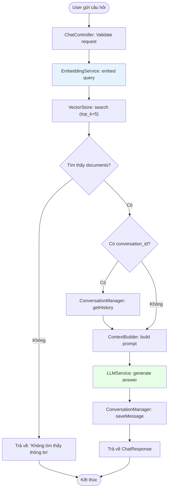

### 5.7.2. Vector Stats Retrieval

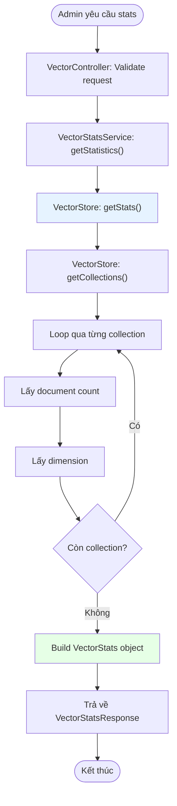

### 5.7.3. Document Sync Processing

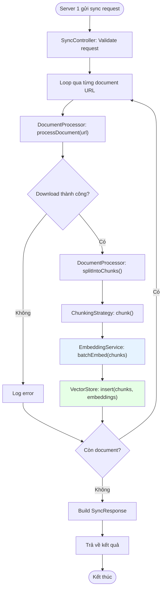

## 5.8. Biểu đồ tuần tự

### 5.8.1. Chat Query Processing

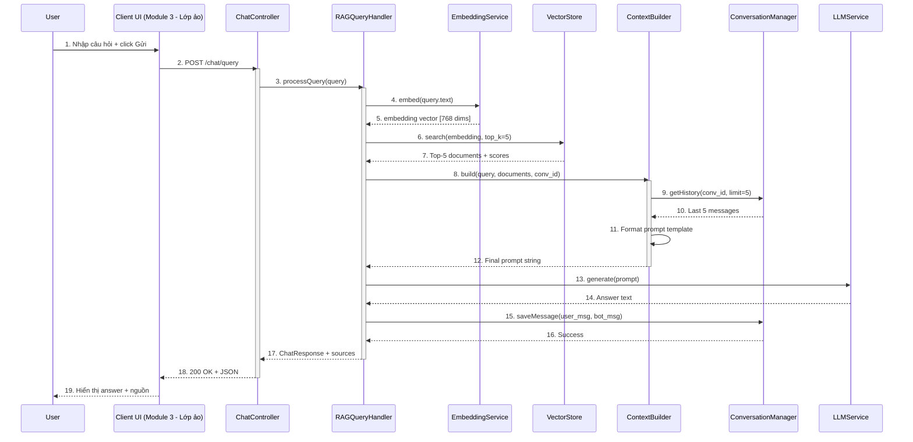

**Mô tả các bước:**
1. User nhập câu hỏi và nhấn nút Gửi
2. Client UI gửi POST request tới ChatController
3. Controller gọi RAGQueryHandler để xử lý RAG pipeline
4-5. Embedding service convert query thành vector 768 chiều
6-7. Vector store tìm kiếm 5 documents gần nhất (cosine similarity)
8. ContextBuilder nhận query + documents + conversation_id
9-10. ContextBuilder load 5 messages cuối từ ConversationManager
11. ContextBuilder format: system prompt + context + history + query
12. Trả final prompt string cho RAGQueryHandler
13-14. LLM service generate answer từ prompt
15-16. ConversationManager lưu cả user message và bot message
17. RAGQueryHandler trả ChatResponse (answer + sources)
18. Controller trả 200 OK với JSON response
19. Client UI hiển thị answer và nguồn tài liệu tham khảo

### 5.8.2. Vector Stats Retrieval

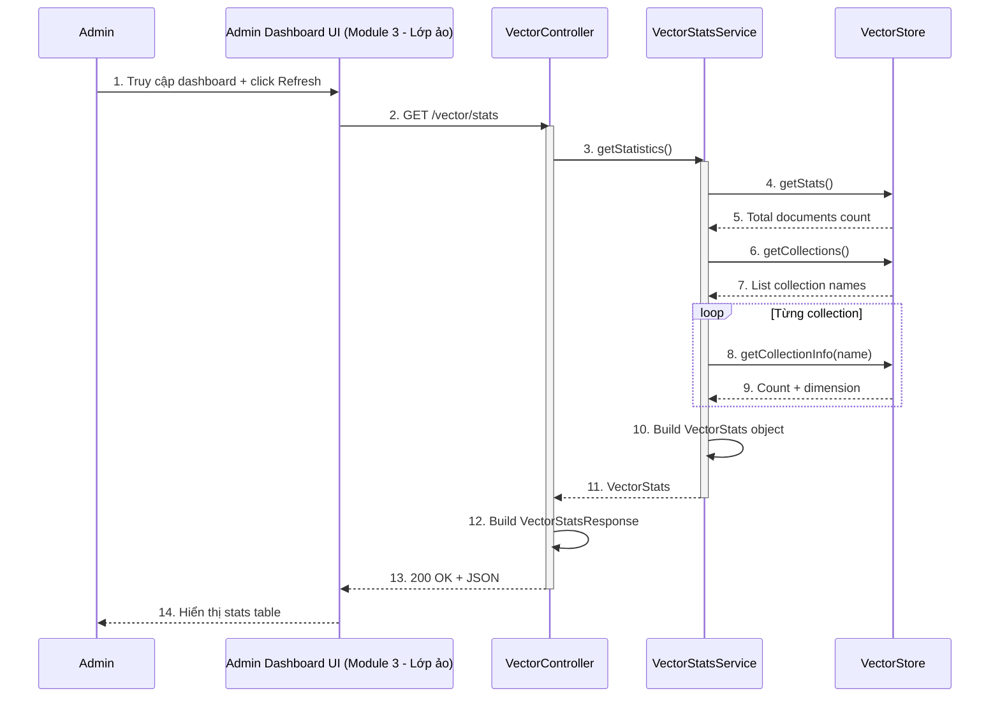

**Mô tả các bước:**
1. Admin truy cập dashboard và click nút Refresh để làm mới stats
2. Admin UI gửi GET request tới VectorController
3. Controller gọi VectorStatsService để lấy thống kê
4-5. Service lấy tổng số documents từ VectorStore
6-7. Service lấy danh sách tên collections
8-9. Loop qua từng collection, lấy document count và dimension
10. Service build VectorStats object với tất cả thông tin
11. Service trả VectorStats về Controller
12. Controller tạo VectorStatsResponse (DTO)
13. Controller trả 200 OK với JSON response
14. Admin UI render bảng thống kê với số liệu real-time

### 5.8.3. Document Sync Processing

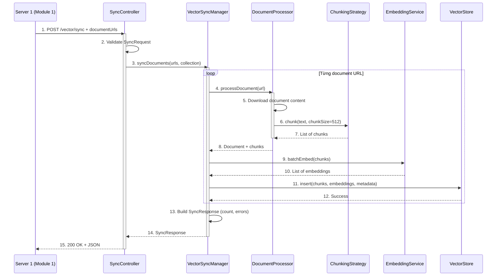

**Mô tả các bước:**
1. Server 1 gửi POST request với danh sách document URLs cần sync
2. Controller validate SyncRequest (urls không empty, collection name valid)
3. Controller gọi VectorSyncManager để xử lý sync pipeline
4. Manager loop qua từng URL, gọi DocumentProcessor
5. Processor download nội dung document từ URL
6-7. Processor dùng ChunkingStrategy để split text thành chunks (512 tokens)
8. Processor trả document đã xử lý và danh sách chunks
9-10. Manager gọi EmbeddingService để tạo embeddings cho tất cả chunks (batch)
11-12. Manager insert chunks + embeddings + metadata vào VectorStore (ChromaDB)
13. Manager build SyncResponse với số documents processed, chunks created, errors
14. Manager trả SyncResponse về Controller
15. Controller trả 200 OK với JSON response về Server 1

---


## 6. TƯƠNG TÁC VỚI CÁC MODULE KHÁC

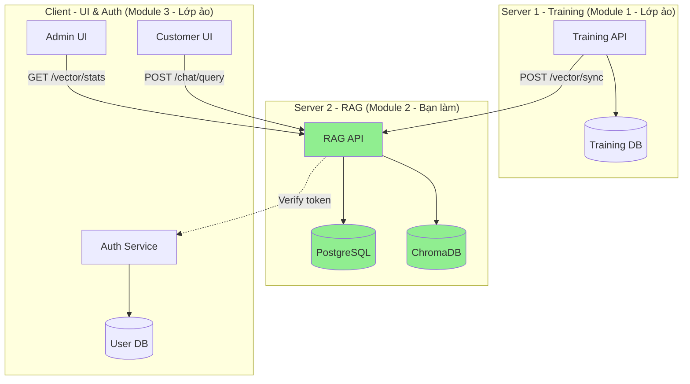

**Module 2 cần từ Module 1:**
- `POST /vector/sync`: Nhận documents để đồng bộ

**Module 2 cần từ Module 3:**
- `POST /auth/verify`: Verify JWT token

**Module 2 cung cấp cho Module 3:**
- `POST /chat/query`: Chat API
- `GET /vector/stats`: Admin statistics
- `GET /conversations/{user_id}`: Lấy lịch sử chat

---

## 7. PROMPT ENGINEERING

### 7.1. Prompt Template

```python
SYSTEM_PROMPT = """Bạn là chatbot tư vấn của PTIT.
Nhiệm vụ: Trả lời câu hỏi dựa trên thông tin được cung cấp.
Nguyên tắc:
- Chỉ trả lời dựa trên context
- Nếu không có thông tin, nói rõ "Tôi không tìm thấy thông tin này"
- Trả lời ngắn gọn, chính xác"""

USER_PROMPT_TEMPLATE = """
Context (Tài liệu tìm được):
{retrieved_documents}

Lịch sử hội thoại:
{conversation_history}

Câu hỏi: {user_query}

Trả lời:"""
```

### 7.2. Context Building

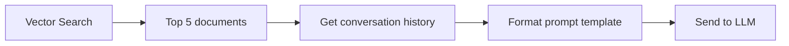

---

## 8. KẾT LUẬN

Module 2 là **trung tâm xử lý RAG**:

### 8.1. Tổng kết
- ✅ **2 chức năng chính**:
  - **User Management**: Quản lý customer users (CRUD operations)
  - **RAG System**: Tích hợp 3 chức năng con (Chat với user, Quản lý vector DB, Đồng bộ documents)
- ✅ **Mỗi chức năng có**:
  - Thiết kế giao diện (Server API + Client UI mockup với Boundary classes)
  - Class diagram chi tiết + diễn giải lý do thiết kế
  - Activity diagram (luồng xử lý chi tiết cho từng operation)
  - Sequence diagram với đánh số bước + mô tả (không có chi tiết database queries)
- ✅ **Tương tác module**:
  - Nhận document sync từ Server 1
  - Cung cấp Chat API và Vector Stats cho Module 3
  - Verify JWT token với Auth service (Module 3)
- ✅ **CSDL**:
  - ChromaDB (vector embeddings)
  - PostgreSQL (users, conversations, messages, responses, response_documents)

### 8.2. Technology Stack

```
Backend:       FastAPI
Vector DB:     ChromaDB
Database:      PostgreSQL
LLM:           OpenAI API / Local LLM
Embedding:     sentence-transformers
```

### 8.3. Design Patterns

- **MVC**: ChatController, VectorController, SyncController
- **Facade**: RAGQueryHandler, VectorSyncManager
- **Strategy**: ChunkingStrategy (SentenceChunker, TokenChunker)
- **Repository**: ConversationManager
- **DTO**: ChatResponse, VectorStats, SyncResponse
- **Value Object**: Query, CollectionInfo

---

**Ngày hoàn thành:** [Ngày/Tháng/Năm]
**Chữ ký:** _______________
