# BÁO CÁO THIẾT KẾ MODULE 2: CHATBOT APPLICATION & RAG MODULE

**Sinh viên thực hiện:** [Tên bạn]
**Mã sinh viên:** [MSSV]
**Lớp:** [Tên lớp]

---

## 1. TỔNG QUAN MODULE

### 1.1. Vai trò trong hệ thống
Module 2 đóng vai trò là **trung tâm xử lý RAG (Retrieval-Augmented Generation)** và cung cấp API chatbot cho người dùng cuối. Module này:
- Nhận câu hỏi từ Client 2 (Customer)
- Tìm kiếm thông tin liên quan từ vector database
- Tổng hợp context và sinh câu trả lời qua LLM
- Đồng bộ documents từ Server 1
- Trả kết quả về Client 2

### 1.2. Chức năng chính
Module hoạt động như một **RAG Pipeline** bao gồm:
- **Chức năng 1**: User Management (Quản lý customer users)
- **Chức năng 2**: RAG Query Processing (Chat với user)
- **Chức năng 3**: Vector Database Management (Quản lý vector store)
- **Chức năng 4**: Document Sync (Đồng bộ với Server 1)

### 1.3. Công nghệ sử dụng
- **Backend Framework**: FastAPI
- **Vector Database**: ChromaDB
- **LLM**: OpenAI API / Local LLM
- **Embedding Model**: sentence-transformers
- **Database**: PostgreSQL (conversations)

---

## 2. THIẾT KẾ CƠ SỞ DỮ LIỆU

### 2.1. Vector Database Schema (ChromaDB)

#### Collection: `ptit_knowledge_base`
```python
{
    "id": "doc_001",
    "document": "Nội dung văn bản gốc",
    "metadata": {
        "source": "ptit_tuyen_sinh.pdf",
        "category": "tuyen_sinh",
        "chunk_index": 0
    },
    "embedding": [0.123, 0.456, ...] # Vector 768 chiều
}
```

**Giải thích:**
- `id`: Unique identifier cho mỗi chunk
- `document`: Văn bản đã được chunking
- `metadata`: Thông tin nguồn gốc, danh mục
- `embedding`: Vector đại diện ngữ nghĩa

### 2.2. User & Conversation Schema (PostgreSQL)

#### Table: `users`
```sql
CREATE TABLE users (
    user_id VARCHAR(36) PRIMARY KEY,
    username VARCHAR(100) UNIQUE NOT NULL,
    email VARCHAR(255) UNIQUE NOT NULL,
    full_name VARCHAR(255),
    created_at TIMESTAMP DEFAULT CURRENT_TIMESTAMP,
    updated_at TIMESTAMP DEFAULT CURRENT_TIMESTAMP,
    is_active BOOLEAN DEFAULT TRUE
);
```

#### Table: `conversations`
```sql
CREATE TABLE conversations (
    conversation_id VARCHAR(36) PRIMARY KEY,
    user_id VARCHAR(36) NOT NULL REFERENCES users(user_id),
    created_at TIMESTAMP DEFAULT CURRENT_TIMESTAMP
);
```

#### Table: `messages`
```sql
CREATE TABLE messages (
    message_id VARCHAR(36) PRIMARY KEY,
    conversation_id VARCHAR(36) REFERENCES conversations(conversation_id),
    role VARCHAR(10) NOT NULL, -- 'user' or 'assistant'
    content TEXT NOT NULL,
    created_at TIMESTAMP DEFAULT CURRENT_TIMESTAMP
);
```

#### Table: `responses`
```sql
CREATE TABLE responses (
    response_id VARCHAR(36) PRIMARY KEY,
    conversation_id VARCHAR(36) REFERENCES conversations(conversation_id),
    answer TEXT NOT NULL,
    created_at TIMESTAMP DEFAULT CURRENT_TIMESTAMP
);
```

#### Table: `response_documents` (Bảng trung gian)
```sql
CREATE TABLE response_documents (
    response_id VARCHAR(36) REFERENCES responses(response_id),
    document_id VARCHAR(255) NOT NULL, -- ID từ ChromaDB
    relevance_score FLOAT,
    ranking INT,
    PRIMARY KEY (response_id, document_id)
);
```

**Giải thích bảng trung gian:**
- `response_id`: FK tới bảng responses
- `document_id`: ID của document trong ChromaDB
- `relevance_score`: Điểm tương đồng cosine (0-1)
- `ranking`: Thứ hạng trong top-k results (1, 2, 3...)

---

## 3. THIẾT KẾ LỚP THỰC THỂ

### 3.1. Entity Classes

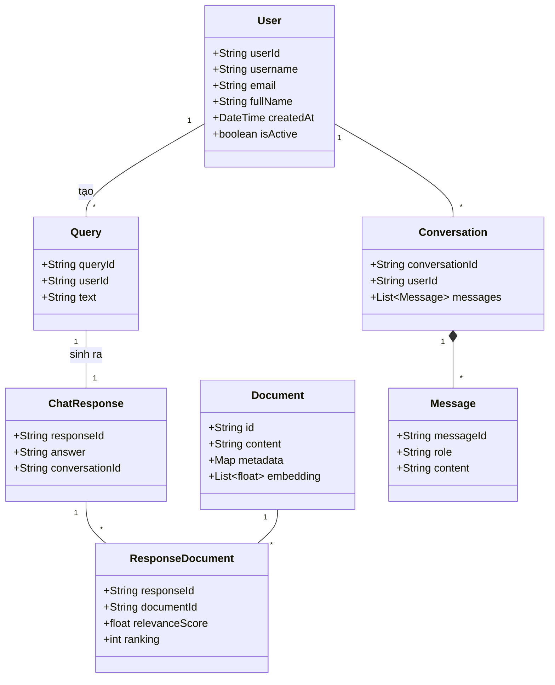

### 3.2. Mô tả quan hệ

**Quan hệ chính:**

1. **User - Conversation (1-N)**:
   - Một user có nhiều conversations
   - Mỗi conversation thuộc về 1 user

2. **Conversation - Message (1-N, Composition)**:
   - Một conversation chứa nhiều messages
   - Message không tồn tại độc lập ngoài conversation (composition)

3. **User - Query (1-N)**:
   - Một user gửi nhiều queries (câu hỏi)
   - Mỗi query được tạo bởi 1 user

4. **Query - ChatResponse (1-1)**:
   - Mỗi query sinh ra 1 response
   - Response là kết quả trả lời của query

5. **ChatResponse - Document (N-N qua ResponseDocument)**:
   - **Bảng trung gian**: `ResponseDocument`
   - Một response tham chiếu nhiều documents (top-k retrieval results)
   - Một document có thể được dùng trong nhiều responses
   - Lưu thêm: `relevanceScore` (độ tương đồng), `ranking` (thứ hạng)

6. **ResponseDocument (Association Class)**:
   - Link giữa ChatResponse và Document
   - Chứa metadata: điểm relevance, thứ tự ranking
   - Giúp tracking documents nào được dùng cho response nào

**Luồng dữ liệu:**
```
User → Query → [RAG Pipeline] → Vector Search → Document
                                      ↓
                                ChatResponse ← ResponseDocument (link docs)
                                      ↓
                             Conversation → Message (lưu user query + bot answer)
```

---

## 4. KIẾN TRÚC HỆ THỐNG

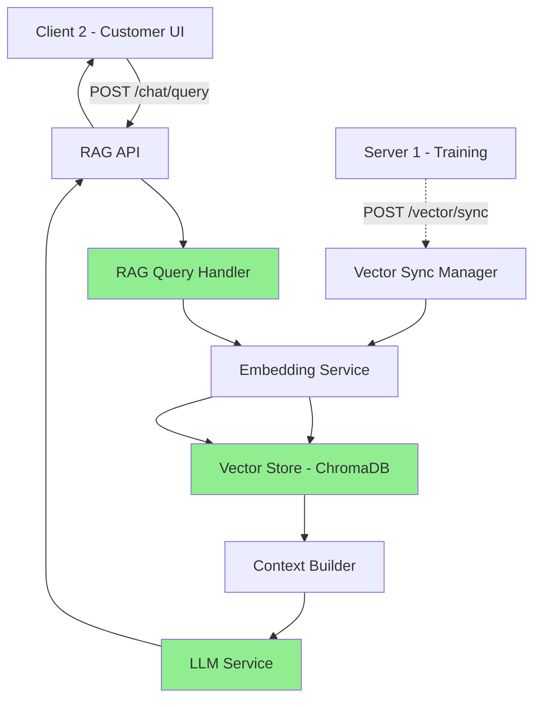

---

# CHỨC NĂNG 1: USER MANAGEMENT (QUẢN LÝ CUSTOMER USERS)

## 5.1. Thiết kế giao diện

### 5.1.1. Server Backend API

#### Endpoint: `POST /api/v1/users` (Tạo user mới)

**Request:**
```json
{
    "username": "nguyenvana",
    "email": "nguyenvana@ptit.edu.vn",
    "full_name": "Nguyễn Văn A"
}
```

**Response:**
```json
{
    "success": true,
    "data": {
        "user_id": "user_123",
        "username": "nguyenvana",
        "email": "nguyenvana@ptit.edu.vn",
        "full_name": "Nguyễn Văn A",
        "created_at": "2025-01-15T10:30:00Z",
        "is_active": true
    }
}
```

#### Endpoint: `GET /api/v1/users/{user_id}` (Lấy thông tin user)

**Response:**
```json
{
    "success": true,
    "data": {
        "user_id": "user_123",
        "username": "nguyenvana",
        "email": "nguyenvana@ptit.edu.vn",
        "full_name": "Nguyễn Văn A",
        "created_at": "2025-01-15T10:30:00Z",
        "is_active": true
    }
}
```

#### Endpoint: `PUT /api/v1/users/{user_id}` (Cập nhật user)

**Request:**
```json
{
    "full_name": "Nguyễn Văn A (Updated)",
    "email": "nguyenvana_new@ptit.edu.vn"
}
```

#### Endpoint: `DELETE /api/v1/users/{user_id}` (Xóa/vô hiệu hóa user)

**Response:**
```json
{
    "success": true,
    "message": "User deactivated successfully"
}
```

### 5.1.2. Admin UI (Lớp ảo - Module 3)

**Giao diện quản lý users:**

```
┌──────────────────────────────────────────────┐
│  PTIT Admin - User Management               │
├──────────────────────────────────────────────┤
│                                              │
│  👥 Users List                               │
│  ┌────────────────────────────────────────┐ │
│  │ ID      Username    Email       Status │ │
│  │ user_1  nguyenvana  nva@ptit... Active │ │
│  │ user_2  tranthib    ttb@ptit... Active │ │
│  │ user_3  levanc      lvc@ptit... Inactive│ │
│  └────────────────────────────────────────┘ │
│                                              │
│  [Add User] [Search] [Export]               │
└──────────────────────────────────────────────┘
```

## 5.2. Thiết kế lớp chi tiết

### 5.2.1. Class Diagram

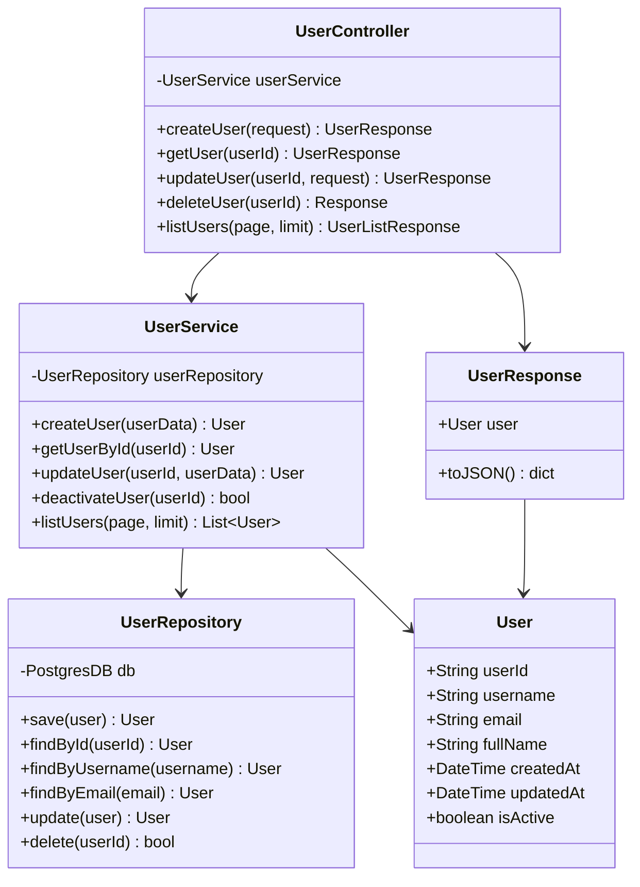

### 5.2.2. Diễn giải thiết kế

**Tại sao có các lớp này:**

1. **UserController**:
   - **Lý do**: HTTP layer cho user management (MVC pattern)
   - **Trách nhiệm**: Handle CRUD requests, validation
   - **Phương thức**: `createUser()`, `getUser()`, `updateUser()`, `deleteUser()`, `listUsers()`

2. **UserService**:
   - **Lý do**: Business logic cho user operations (Service pattern)
   - **Trách nhiệm**: Validate business rules, orchestrate operations
   - **Phương thức**: `createUser()`, `getUserById()`, `updateUser()`, `deactivateUser()`

3. **UserRepository**:
   - **Lý do**: Data access layer (Repository pattern)
   - **Trách nhiệm**: CRUD operations với PostgreSQL
   - **Phương thức**: `save()`, `findById()`, `findByUsername()`, `update()`, `delete()`

4. **User** (Entity):
   - **Lý do**: Domain entity
   - **Trách nhiệm**: Represent user data

5. **UserResponse** (DTO):
   - **Lý do**: Standardized API response
   - **Trách nhiệm**: Serialize user data cho client

## 5.3. Biểu đồ hoạt động

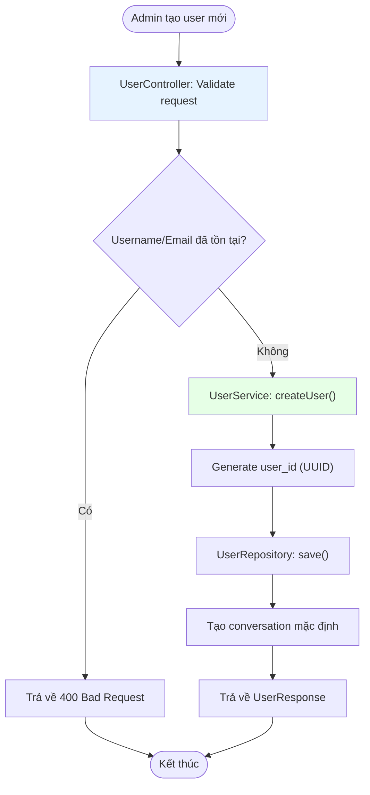

## 5.4. Biểu đồ tuần tự

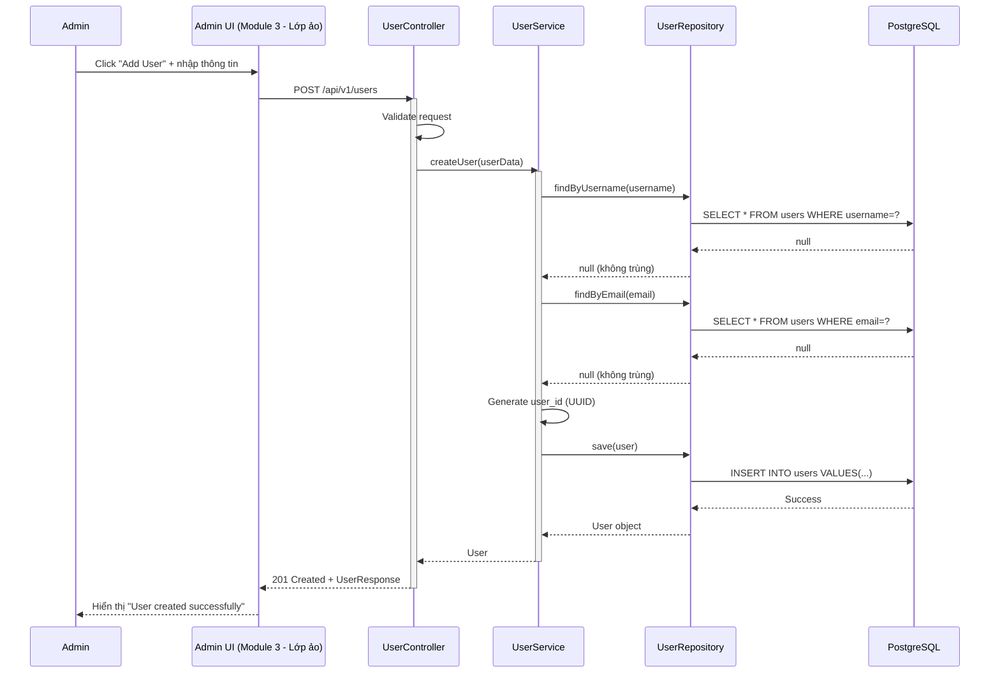

---

# CHỨC NĂNG 2: RAG QUERY PROCESSING (CHAT VỚI USER)

## 5.5. Thiết kế giao diện

### 5.5.1. Server Backend API

#### Endpoint: `POST /api/v1/chat/query`

**Request:**
```json
{
    "query": "Học phí ngành CNTT năm 2025 là bao nhiêu?",
    "user_id": "user_123",
    "conversation_id": "conv_456"
}
```

**Response:**
```json
{
    "success": true,
    "data": {
        "answer": "Học phí ngành Công nghệ Thông tin năm 2025 là 12.000.000 VNĐ/năm...",
        "conversation_id": "conv_456",
        "sources": [
            {
                "doc_id": "doc_001",
                "content": "Học phí các ngành năm 2025: CNTT: 12tr...",
                "source": "tuyen_sinh_2025.pdf"
            }
        ]
    }
}
```

### 5.5.2. Client UI (Lớp ảo - Module 3)

**Giao diện chat:**

```
┌────────────────────────────────────────┐
│  PTIT Chatbot - Tư vấn sinh viên      │
├────────────────────────────────────────┤
│                                        │
│  User: Học phí CNTT 2025 bao nhiêu?   │
│                                        │
│  Bot: Học phí ngành Công nghệ Thông   │
│       tin năm 2025 là 12.000.000      │
│       VNĐ/năm...                      │
│                                        │
│       📄 Nguồn: tuyen_sinh_2025.pdf   │
│                                        │
├────────────────────────────────────────┤
│  [Nhập câu hỏi...]            [Gửi]  │
└────────────────────────────────────────┘
```

**Client → Server 2:**
```javascript
POST /api/v1/chat/query
Headers: { Authorization: "Bearer <token>" }
Body: { query, user_id, conversation_id }
```

## 5.6. Thiết kế lớp chi tiết

### 5.6.1. Class Diagram

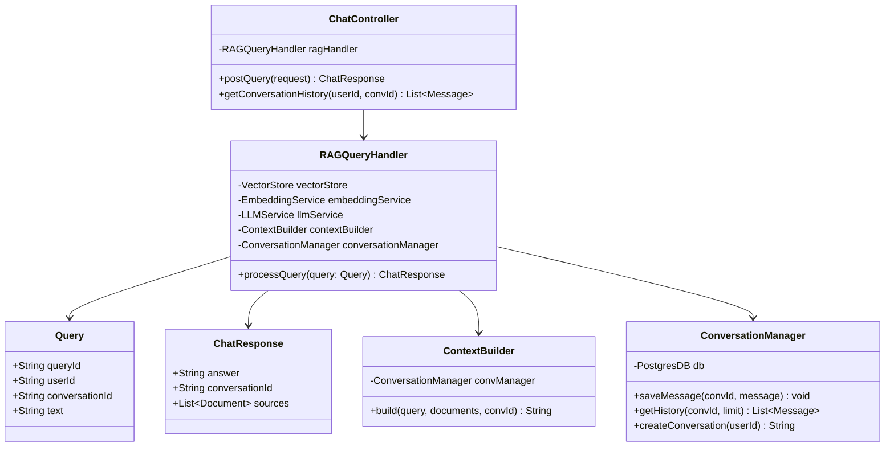

### 5.6.2. Diễn giải thiết kế

**Tại sao có các lớp này:**

1. **ChatController**:
   - **Lý do**: Tách biệt HTTP layer với business logic (MVC pattern)
   - **Trách nhiệm**: Xử lý HTTP requests, validation
   - **Phương thức**: `postQuery()`, `getConversationHistory()`

2. **RAGQueryHandler**:
   - **Lý do**: Điều phối toàn bộ RAG pipeline (Facade pattern)
   - **Trách nhiệm**: Orchestrate: embed → search → build context → generate
   - **Phương thức**: `processQuery()` - main workflow

3. **Query** (Value Object):
   - **Lý do**: Encapsulate thông tin query
   - **Trách nhiệm**: Validation, type safety

4. **ChatResponse** (DTO):
   - **Lý do**: Standardized response format
   - **Trách nhiệm**: Đảm bảo contract với client

5. **ContextBuilder**:
   - **Lý do**: Xây dựng prompt cho LLM
   - **Trách nhiệm**: Format documents + conversation history thành prompt

6. **ConversationManager**:
   - **Lý do**: Quản lý conversation persistence
   - **Trách nhiệm**: CRUD operations với PostgreSQL

## 5.7. Biểu đồ hoạt động


## 5.8. Biểu đồ tuần tự

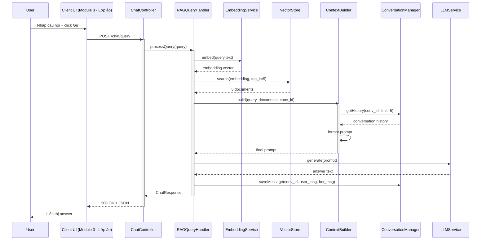

---

# CHỨC NĂNG 3: VECTOR DATABASE MANAGEMENT

## 5.9. Thiết kế giao diện

### 5.9.1. Server Backend API

#### Endpoint: `GET /api/v1/vector/stats`

**Response:**
```json
{
    "success": true,
    "data": {
        "total_documents": 10245,
        "collections": [
            {
                "name": "ptit_knowledge_base",
                "count": 10245,
                "categories": {
                    "tuyen_sinh": 3420,
                    "hoc_phi": 1250,
                    "chuong_trinh_dao_tao": 5575
                }
            }
        ]
    }
}
```

### 5.9.2. Admin Dashboard UI (Lớp ảo - Module 3)

```
┌──────────────────────────────────────────────┐
│  PTIT Admin - Vector Database Management    │
├──────────────────────────────────────────────┤
│                                              │
│  📊 Statistics                               │
│  ├─ Total Documents: 10,245                 │
│  └─ Collections: 1                          │
│                                              │
│  📁 Categories                               │
│  ├─ Tuyển sinh: 3,420 (33%)                │
│  ├─ Học phí: 1,250 (12%)                   │
│  └─ Đào tạo: 5,575 (55%)                   │
│                                              │
│  ⚙️ Actions                                  │
│  [View Documents] [Search] [Export]         │
└──────────────────────────────────────────────┘
```

## 5.10. Thiết kế lớp chi tiết

### 5.10.1. Class Diagram

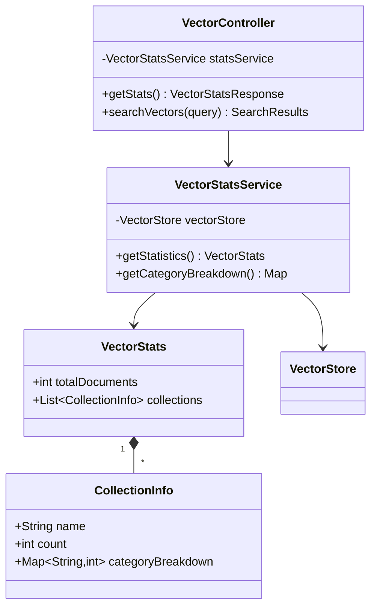

### 5.10.2. Diễn giải thiết kế

1. **VectorController**:
   - **Lý do**: Expose management APIs cho admin
   - **Trách nhiệm**: Handle HTTP requests
   - **Phương thức**: `getStats()`, `searchVectors()`

2. **VectorStatsService**:
   - **Lý do**: Business logic thu thập statistics
   - **Trách nhiệm**: Aggregate data từ VectorStore
   - **Phương thức**: `getStatistics()`, `getCategoryBreakdown()`

3. **VectorStats** (DTO):
   - **Lý do**: Structured stats data
   - **Trách nhiệm**: Serialize cho API response

4. **CollectionInfo**:
   - **Lý do**: Represent collection metadata
   - **Trách nhiệm**: Chi tiết từng collection

## 5.11. Biểu đồ hoạt động

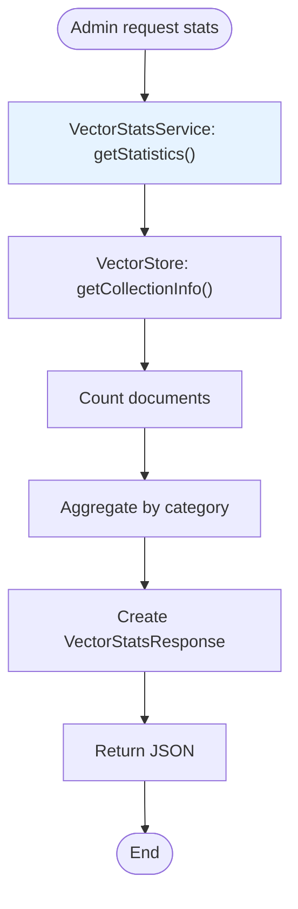

## 5.12. Biểu đồ tuần tự

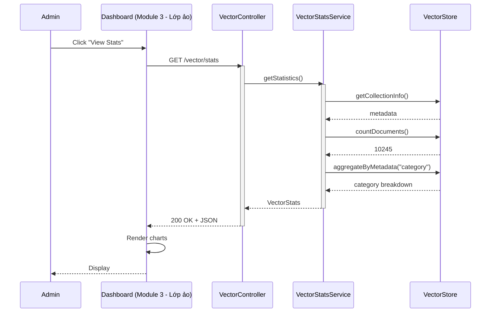

---

# CHỨC NĂNG 4: DOCUMENT SYNC (ĐỒNG BỘ VỚI SERVER 1)

## 5.13. Thiết kế giao diện

### 5.13.1. Server Backend API

#### Endpoint: `POST /api/v1/vector/sync`

**Request từ Server 1:**
```json
{
    "source": "server1_training",
    "operation": "upsert",
    "documents": [
        {
            "id": "doc_001",
            "content": "Nội dung tài liệu...",
            "metadata": {
                "source": "file.pdf",
                "category": "tuyen_sinh"
            }
        }
    ]
}
```

**Response:**
```json
{
    "success": true,
    "data": {
        "synced_count": 145,
        "total_vectors": 10390,
        "sync_time_ms": 3250
    }
}
```

### 5.13.2. Server 1 Integration (Lớp ảo)

**Workflow:**

```
Server 1                      Server 2
────────                      ────────
1. Admin upload docs
2. Process documents
3. Trigger sync      ──────>  1. Validate request
                              2. Process + chunk
                              3. Generate embeddings
                              4. Upsert ChromaDB
                    <──────   5. Return result
4. Handle response
```

## 5.14. Thiết kế lớp chi tiết

### 5.14.1. Class Diagram

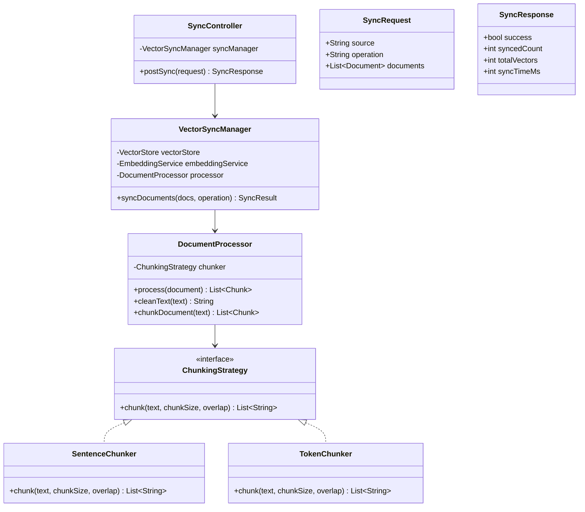

### 5.14.2. Diễn giải thiết kế

1. **SyncController**:
   - **Lý do**: Entry point cho sync từ Server 1
   - **Trách nhiệm**: Validate request, route requests
   - **Phương thức**: `postSync()`

2. **VectorSyncManager**:
   - **Lý do**: Orchestrate sync pipeline
   - **Trách nhiệm**: Process → Embed → Upsert
   - **Phương thức**: `syncDocuments()`

3. **DocumentProcessor**:
   - **Lý do**: Processing logic
   - **Trách nhiệm**: Clean text, chunk documents
   - **Phương thức**: `process()`, `chunkDocument()`

4. **ChunkingStrategy**:
   - **Lý do**: Flexible chunking algorithms (Strategy pattern)
   - **Implementations**: SentenceChunker (chunk theo câu), TokenChunker (chunk theo token)

## 5.15. Biểu đồ hoạt động

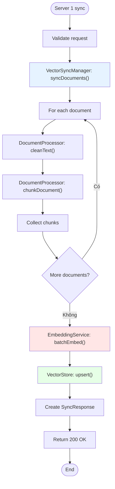

## 5.16. Biểu đồ tuần tự

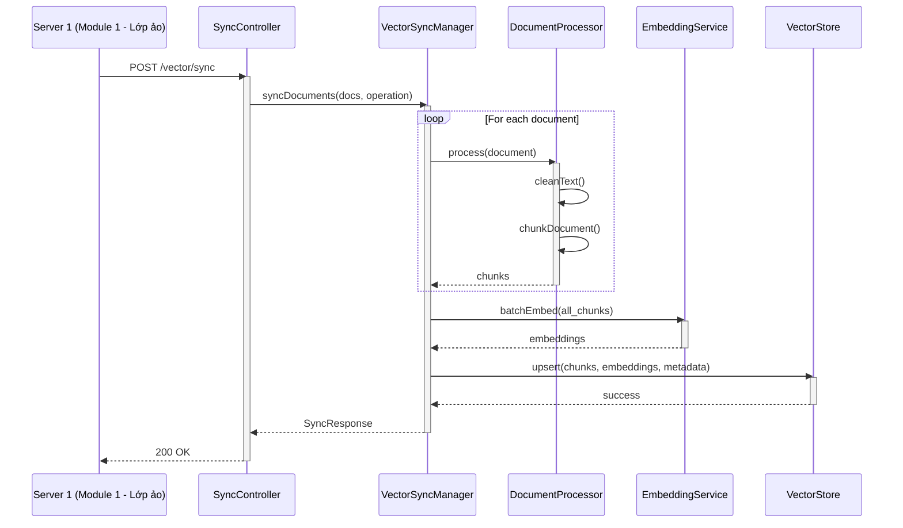

---

## 6. TƯƠNG TÁC VỚI CÁC MODULE KHÁC

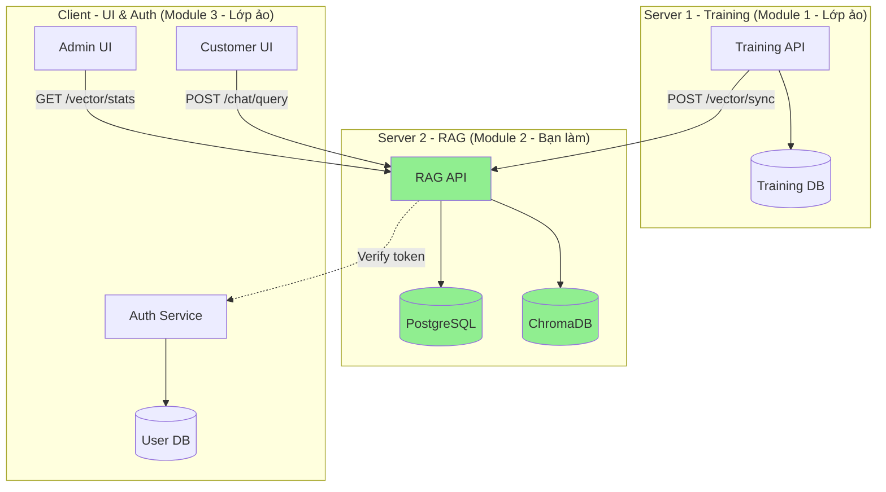

**Module 2 cần từ Module 1:**
- `POST /vector/sync`: Nhận documents để đồng bộ

**Module 2 cần từ Module 3:**
- `POST /auth/verify`: Verify JWT token

**Module 2 cung cấp cho Module 3:**
- `POST /chat/query`: Chat API
- `GET /vector/stats`: Admin statistics
- `GET /conversations/{user_id}`: Lấy lịch sử chat

---

## 7. PROMPT ENGINEERING

### 7.1. Prompt Template

```python
SYSTEM_PROMPT = """Bạn là chatbot tư vấn của PTIT.
Nhiệm vụ: Trả lời câu hỏi dựa trên thông tin được cung cấp.
Nguyên tắc:
- Chỉ trả lời dựa trên context
- Nếu không có thông tin, nói rõ "Tôi không tìm thấy thông tin này"
- Trả lời ngắn gọn, chính xác"""

USER_PROMPT_TEMPLATE = """
Context (Tài liệu tìm được):
{retrieved_documents}

Lịch sử hội thoại:
{conversation_history}

Câu hỏi: {user_query}

Trả lời:"""
```

### 7.2. Context Building

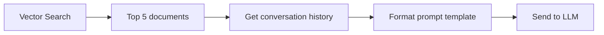

---

## 8. KẾT LUẬN

Module 2 là **trung tâm xử lý RAG**:

### 8.1. Tổng kết
- ✅ **4 chức năng**: User Management, Query Processing, Vector Management, Document Sync
- ✅ **Mỗi chức năng có**:
  - Thiết kế giao diện (Server API + Client UI mockup)
  - Class diagram chi tiết + diễn giải lý do thiết kế
  - Activity diagram (luồng xử lý)
  - Sequence diagram (tương tác với lớp ảo)
- ✅ **Tương tác module**: Sync với Server 1, Auth/UI với Module 3
- ✅ **CSDL**: ChromaDB (vectors) + PostgreSQL (conversations)

### 8.2. Technology Stack

```
Backend:       FastAPI
Vector DB:     ChromaDB
Database:      PostgreSQL
LLM:           OpenAI API / Local LLM
Embedding:     sentence-transformers
```

### 8.3. Design Patterns

- **MVC**: ChatController, VectorController, SyncController
- **Facade**: RAGQueryHandler, VectorSyncManager
- **Strategy**: ChunkingStrategy (SentenceChunker, TokenChunker)
- **Repository**: ConversationManager
- **DTO**: ChatResponse, VectorStats, SyncResponse
- **Value Object**: Query, CollectionInfo

---

**Ngày hoàn thành:** [Ngày/Tháng/Năm]
**Chữ ký:** _______________
