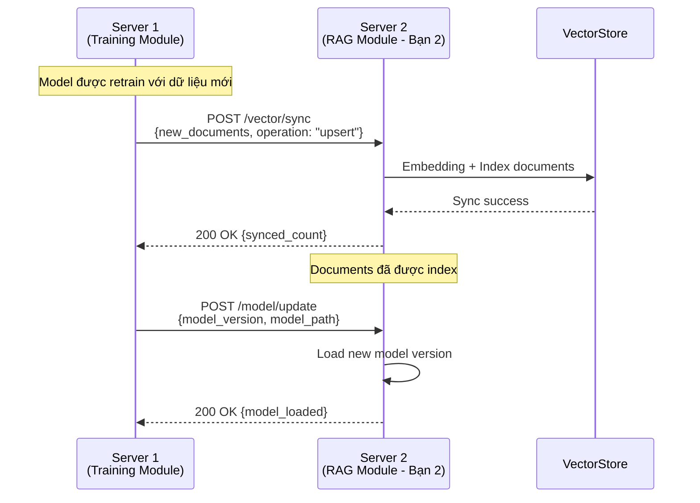

# BÁO CÁO THIẾT KẾ MODULE 2: CHATBOT APPLICATION & RAG MODULE

**Sinh viên thực hiện:** [Tên bạn]
**Mã sinh viên:** [MSSV]
**Lớp:** [Tên lớp]

---

## 1. TỔNG QUAN MODULE

### 1.1. Vai trò trong hệ thống
Module 2 đóng vai trò là **trung tâm xử lý RAG (Retrieval-Augmented Generation)** và cung cấp API chatbot cho người dùng cuối. Module này:
- Nhận câu hỏi từ Client 2 (Customer)
- Tìm kiếm thông tin liên quan từ vector database
- Tổng hợp context và sinh câu trả lời qua LLM
- Tích hợp model từ Server 1
- Trả kết quả về Client 2

### 1.2. Chức năng chính
1. **RAG Query Processing**: Xử lý câu hỏi và truy xuất thông tin
2. **Vector Database Management**: Quản lý embedding và similarity search
3. **Context Synthesis**: Tổng hợp context từ nhiều nguồn
4. **LLM Integration**: Tích hợp với LLM để sinh câu trả lời
5. **API Service**: Cung cấp RESTful API cho Client

### 1.3. Công nghệ sử dụng
- **Backend Framework**: FastAPI / Flask
- **Vector Database**: ChromaDB / Pinecone
- **LLM**: OpenAI API / Local LLM
- **Embedding Model**: sentence-transformers / OpenAI embeddings
- **Cache**: Redis (optional)

---

## 2. THIẾT KẾ CƠ SỞ DỮ LIỆU

### 2.1. Vector Database Schema (ChromaDB)

#### Collection: `ptit_knowledge_base`
```python
{
    "id": "doc_001",
    "document": "Nội dung văn bản gốc",
    "metadata": {
        "source": "ptit_tuyen_sinh.pdf",
        "category": "tuyen_sinh",
        "chunk_index": 0,
        "timestamp": "2025-01-15T10:30:00Z",
        "version": "v1.0"
    },
    "embedding": [0.123, 0.456, ...] # Vector 384 chiều
}
```

**Giải thích:**
- `id`: Unique identifier cho mỗi chunk
- `document`: Văn bản đã được chunking
- `metadata.source`: File nguồn gốc
- `metadata.category`: Danh mục (tuyển sinh, học phí, chương trình đào tạo, v.v.)
- `metadata.chunk_index`: Thứ tự chunk trong document
- `embedding`: Vector đại diện ngữ nghĩa

### 2.2. Cache Database Schema (Redis - Optional)

#### Key Pattern: `query_cache:{query_hash}`
```json
{
    "query": "Học phí ngành CNTT là bao nhiêu?",
    "response": {
        "answer": "Học phí ngành CNTT là...",
        "sources": ["doc_001", "doc_045"],
        "confidence": 0.92
    },
    "timestamp": 1705310400,
    "ttl": 3600
}
```

### 2.3. Conversation History Schema (MongoDB/PostgreSQL)

#### Table: `conversations`
```sql
CREATE TABLE conversations (
    conversation_id VARCHAR(36) PRIMARY KEY,
    user_id VARCHAR(36) NOT NULL,
    created_at TIMESTAMP DEFAULT CURRENT_TIMESTAMP,
    updated_at TIMESTAMP DEFAULT CURRENT_TIMESTAMP,
    status VARCHAR(20) DEFAULT 'active'
);
```

#### Table: `messages`
```sql
CREATE TABLE messages (
    message_id VARCHAR(36) PRIMARY KEY,
    conversation_id VARCHAR(36) REFERENCES conversations(conversation_id),
    role VARCHAR(10) NOT NULL, -- 'user' or 'assistant'
    content TEXT NOT NULL,
    sources JSON, -- [{doc_id, score, snippet}, ...]
    created_at TIMESTAMP DEFAULT CURRENT_TIMESTAMP,
    metadata JSON -- {model_version, response_time, etc.}
);
```

---

## 3. THIẾT KẾ LỚP THỰC THỂ (CLASS DIAGRAM)

### 3.1. Entity Classes


**Giải thích các lớp:**

1. **Document**: Đại diện cho một document chunk trong vector DB
   - `getChunks()`: Chia nhỏ document thành chunks
   - `toDict()`: Chuyển sang dictionary để lưu vào DB

2. **DocumentMetadata**: Metadata của document
   - Lưu thông tin nguồn gốc, phân loại, version

3. **Query**: Đại diện cho câu hỏi từ user
   - `toEmbedding()`: Chuyển text thành vector embedding

4. **SearchResult**: Kết quả tìm kiếm từ vector DB
   - Chứa document, score similarity, metadata

5. **ChatResponse**: Câu trả lời cuối cùng gửi về client
   - Bao gồm answer, sources, confidence score

6. **Conversation & Message**: Lưu lịch sử hội thoại
   - `getContext()`: Lấy n tin nhắn gần nhất làm context

---

## 4. THIẾT KẾ CHI TIẾT CÁC CHỨC NĂNG

---

## CHỨC NĂNG 1: RAG QUERY PROCESSING

### 4.1.1. Mô tả
Xử lý câu hỏi từ user, tìm kiếm thông tin liên quan, tổng hợp context và sinh câu trả lời.

### 4.1.2. Thiết kế giao diện API

#### Endpoint: `POST /api/v1/chat/query`

**Request:**
```json
{
    "query": "Học phí ngành CNTT năm 2025 là bao nhiêu?",
    "user_id": "user_123",
    "conversation_id": "conv_456", // optional
    "options": {
        "top_k": 5,
        "temperature": 0.7,
        "use_cache": true
    }
}
```

**Response:**
```json
{
    "success": true,
    "data": {
        "answer": "Học phí ngành Công nghệ Thông tin năm 2025 là 12.000.000 VNĐ/năm theo quy định tại Quyết định số...",
        "conversation_id": "conv_456",
        "sources": [
            {
                "doc_id": "doc_tuyen_sinh_2025_p3",
                "content": "Học phí các ngành năm 2025: CNTT: 12tr...",
                "score": 0.89,
                "metadata": {
                    "source": "tuyen_sinh_2025.pdf",
                    "category": "hoc_phi"
                }
            }
        ],
        "confidence": 0.92,
        "response_time_ms": 450
    }
}
```

### 4.1.3. Biểu đồ lớp chi tiết


**Giải thích các lớp và phương thức:**

1. **RAGQueryHandler** (Main controller)
   - `processQuery()`: Workflow chính xử lý query
   - `retrieveDocuments()`: Tìm kiếm documents liên quan từ vector DB
   - `buildContext()`: Xây dựng context prompt từ query + documents
   - `generateAnswer()`: Gọi LLM để sinh câu trả lời
   - `checkCache()`/`saveCache()`: Tối ưu với cache

2. **VectorStore** (Vector DB interface)
   - `search()`: Semantic search dựa trên embedding similarity
   - `addDocuments()`: Thêm documents mới (sync từ Server 1)

3. **EmbeddingService** (Embedding generator)
   - `embed()`: Chuyển text thành vector
   - `batchEmbed()`: Xử lý nhiều text cùng lúc (hiệu quả hơn)

4. **LLMService** (LLM API wrapper)
   - `generate()`: Sinh câu trả lời từ prompt
   - `streamGenerate()`: Streaming response (real-time chat)

5. **ContextBuilder** (Context engineering)
   - `build()`: Tạo prompt với format chuẩn
   - `rankResults()`: Re-rank kết quả tìm kiếm (cross-encoder optional)
   - `truncateContext()`: Cắt ngắn context nếu vượt token limit

6. **CacheService** (Cache manager)
   - Lưu kết quả query phổ biến để giảm latency & cost

### 4.1.4. Biểu đồ hoạt động (Activity Diagram)

```mermaid
flowchart TD
    Start([Nhận query từ Client]) --> CheckCache{Có trong cache?}
    CheckCache -->|Có| ReturnCache[Trả về kết quả cache]
    ReturnCache --> End([Kết thúc])

    CheckCache -->|Không| Embed[Embedding query thành vector]
    Embed --> Search[Vector similarity search<br/>top_k documents]
    Search --> HasResults{Tìm thấy<br/>documents?}

    HasResults -->|Không| Fallback[Trả về câu trả lời mặc định:<br/>"Xin lỗi, tôi không tìm thấy..."]
    Fallback --> End

    HasResults -->|Có| Rank[Re-rank kết quả<br/>theo relevance]
    Rank --> BuildContext[Xây dựng context prompt:<br/>Query + Top documents]
    BuildContext --> CheckTokens{Context vượt<br/>token limit?}

    CheckTokens -->|Có| Truncate[Cắt bớt documents<br/>ưu tiên score cao]
    Truncate --> Generate
    CheckTokens -->|Không| Generate[Gọi LLM generate answer]

    Generate --> ParseResponse[Parse response +<br/>extract sources]
    ParseResponse --> SaveCache[Lưu vào cache]
    SaveCache --> LogMetrics[Log metrics:<br/>latency, confidence]
    LogMetrics --> Return[Trả về ChatResponse]
    Return --> End
```

### 4.1.5. Biểu đồ tuần tự (Sequence Diagram)


---

## CHỨC NĂNG 2: VECTOR DATABASE MANAGEMENT

### 4.2.1. Mô tả
Quản lý việc đồng bộ documents từ Server 1, embedding, và index vào vector database.

### 4.2.2. Thiết kế giao diện API

#### Endpoint 1: `POST /api/v1/vector/sync`
Đồng bộ documents mới từ Server 1

**Request:**
```json
{
    "source": "server1_model_update",
    "documents": [
        {
            "id": "doc_new_001",
            "content": "Nội dung tài liệu mới...",
            "metadata": {
                "source": "tuyen_sinh_2026.pdf",
                "category": "tuyen_sinh",
                "version": "v2.0"
            }
        }
    ],
    "operation": "upsert" // "upsert" | "delete" | "replace_all"
}
```

**Response:**
```json
{
    "success": true,
    "data": {
        "synced_count": 145,
        "failed_count": 0,
        "total_vectors": 10245,
        "sync_time_ms": 3200
    }
}
```

#### Endpoint 2: `GET /api/v1/vector/stats`
Thống kê vector database

**Response:**
```json
{
    "success": true,
    "data": {
        "total_documents": 10245,
        "collections": [
            {
                "name": "ptit_knowledge_base",
                "count": 10245,
                "dimensions": 768,
                "categories": {
                    "tuyen_sinh": 3420,
                    "hoc_phi": 1250,
                    "chuong_trinh_dao_tao": 5575
                }
            }
        ],
        "last_update": "2025-01-15T14:30:00Z"
    }
}
```

### 4.2.3. Biểu đồ lớp chi tiết


**Giải thích:**

1. **VectorSyncManager** (Sync orchestrator)
   - `syncDocuments()`: Đồng bộ batch documents
   - `rebuildIndex()`: Rebuild toàn bộ index khi cần thiết
   - `batchUpsert()`: Upsert theo batch để tối ưu performance

2. **DocumentProcessor** (Document preprocessing)
   - `process()`: Pipeline xử lý document (clean → chunk → metadata)
   - `cleanText()`: Loại bỏ ký tự đặc biệt, normalize text
   - `extractMetadata()`: Tự động extract metadata từ document

3. **Chunker** (Chunking strategies)
   - `chunkBySentence()`: Chia theo câu (preserves context)
   - `chunkByTokens()`: Chia theo số tokens cố định
   - `chunkSemantic()`: Chia theo ngữ nghĩa (advanced)

4. **SyncQueue** (Async processing queue)
   - Xử lý đồng bộ bất đồng bộ để không block API
   - Batch processing để tối ưu embedding cost

5. **VectorStoreIndex** (Index management)
   - Quản lý HNSW/IVF index parameters
   - Optimize index định kỳ

### 4.2.4. Biểu đồ hoạt động


### 4.2.5. Biểu đồ tuần tự


---

## CHỨC NĂNG 3: CONTEXT SYNTHESIS & RERANKING

### 4.3.1. Mô tả
Tổng hợp context thông minh từ nhiều sources, re-rank kết quả để tăng độ chính xác.

### 4.3.2. Thiết kế giao diện (Internal Service)

```python
# Internal interface - không expose API ra ngoài
class ContextSynthesizer:
    def synthesize(
        self,
        query: Query,
        search_results: List[SearchResult],
        conversation_history: List[Message] = None
    ) -> SynthesizedContext:
        pass
```

### 4.3.3. Biểu đồ lớp chi tiết


**Giải thích:**

1. **ContextSynthesizer** (Main orchestrator)
   - `synthesize()`: Pipeline tổng hợp context
   - `rerank()`: Re-rank kết quả tìm kiếm bằng cross-encoder
   - `mergeConversationContext()`: Tích hợp lịch sử hội thoại
   - `truncateToTokenLimit()`: Cắt bớt nếu vượt token limit

2. **RerankerService** (Re-ranking engine)
   - Sử dụng cross-encoder model (BERT-based) để đánh giá lại relevance
   - `scoreRelevance()`: Tính score giữa query và document (0-1)

3. **PromptTemplate** (Prompt engineering)
   - Quản lý system prompt, user prompt template
   - `fewShotExamples`: Ví dụ mẫu để cải thiện output quality

4. **ConversationManager** (History management)
   - `getHistory()`: Lấy n tin nhắn gần nhất
   - `summarizeHistory()`: Tóm tắt lịch sử nếu quá dài

5. **SynthesizedContext** (Final context object)
   - Chứa prompt đã format, ranked sources, metadata

### 4.3.4. Biểu đồ hoạt động


### 4.3.5. Biểu đồ tuần tự


---

## 5. TƯƠNG TÁC VỚI CÁC MODULE KHÁC

### 5.1. Tương tác với Server 1 (Training Module)



**API cần thiết từ Server 1:**
- `POST /vector/sync`: Đồng bộ documents
- `POST /model/update`: Thông báo model mới
- `GET /documents/latest`: Lấy documents mới nhất

### 5.2. Tương tác với Client 2 (Customer UI)


**API cần từ Client 2/Auth Module:**
- `POST /auth/verify`: Verify JWT token
- `GET /user/{user_id}`: Lấy thông tin user (lưu conversation)

### 5.3. Biểu đồ triển khai (Deployment Diagram)


---

## 6. ĐÁNH GIÁ & TỐI ƯU HÓA

### 6.1. Metrics theo dõi

1. **Performance Metrics:**
   - Response time (p50, p95, p99)
   - Cache hit rate
   - Vector search latency
   - LLM generation time

2. **Quality Metrics:**
   - Confidence score distribution
   - User feedback (thumbs up/down)
   - Source relevance score

3. **System Metrics:**
   - Vector DB size
   - Index optimization frequency
   - Embedding cost per query

### 6.2. Chiến lược tối ưu hóa

1. **Caching Strategy:**
   - Cache câu hỏi phổ biến (FAQ)
   - TTL: 1 giờ cho dynamic content, 24 giờ cho static content

2. **Batch Processing:**
   - Batch embedding để giảm API calls
   - Async vector sync để không block

3. **Index Optimization:**
   - HNSW index với M=16, efConstruction=200
   - Rebuild index khi size tăng 20%

4. **Reranking:**
   - Chỉ rerank top 20 results từ vector search
   - Use cross-encoder cho high-precision tasks

---

## 7. KẾT LUẬN

### 7.1. Tổng kết
Module 2 (RAG Chatbot) là trung tâm xử lý của hệ thống, kết nối:
- **Server 1**: Nhận documents và model updates
- **Client 2**: Phục vụ chat queries cho end-users

Thiết kế tập trung vào:
- **Scalability**: Vector DB có thể scale đến hàng triệu documents
- **Performance**: Cache + batch processing + async
- **Accuracy**: Reranking + context synthesis + conversation history

### 7.2. Công việc tiếp theo
1. Implement core RAG pipeline
2. Setup ChromaDB + embedding service
3. Integration testing với Server 1 và Client 2
4. Performance tuning & monitoring

---

**Ngày hoàn thành:** [Ngày/Tháng/Năm]
**Chữ ký:** _______________
